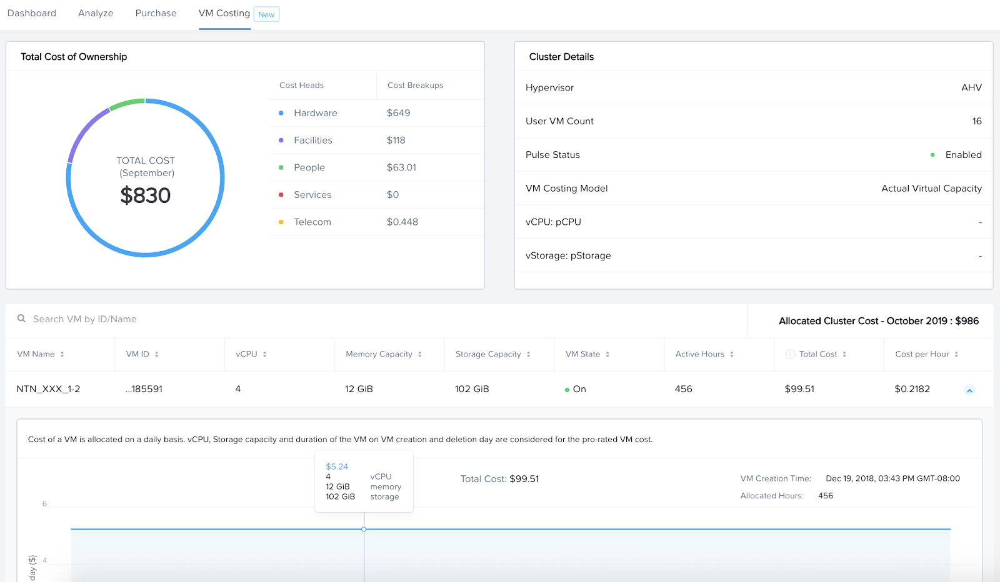

.. title:: Xi Beam - Cost Governance

.. Xi Beam - Cost Governance:

----------------------------
Cost Governance with Xi Beam
----------------------------

Xi Beam is a cost governance and security compliance service that works with both public clouds and Nutanix Private Cloud. This lab introduces Beam’s cost governance capabilities for Nutanix and AWS. Similar capabilities are available for Azure.

What is Cost Governance? It is a set of rules by which you measure your cloud consumption and implement cost control policies. Beam provides the following cost governance capabilities:

- Private Cloud Cost Metering: know how much it really costs to run VMs on Nutanix
- Multi-Cloud Cost Centers: tag-based automated cost reports to identify spending by a cost center or business unit
- Chargeback & Budgeting: drive accountability by allocating any untagged costs to appropriate cost centers and implement budget alerts
- Public Cloud Cost Savings: Reduce public cloud spend by right-sizing resources and Reserved Instance (RI) purchases

**In this lab you will mimic a customer use case of identifying the true cost of running VDI workloads across Nutanix Private Cloud and AWS by various users. By the end of the lab, you will learn:**

- How to use the Nutanix TCO model to calculate the cost of Nutanix clusters and VMs
- How to use Prism categories and AWS tags for spend reporting by a multi-cloud cost center 
- How to implement Chargeback to ensure costs are accurately allocated to cost centers
- How to set up budget alerts to be notified before spending exceed a certain budget
- How to act upon Beam's cost saving recommendations for public clouds like AWS

Logging In
++++++++++

Beam is a SaaS service and does not require any on-premises installation for cost governance. To begin the lab, you will log into the Beam portal using pre-created credentials.

#. In your browser, open https://beam.nutanix.com/ and click **Sign in with My Nutanix**.

#. Click **Login with your Company ID** to login with a custom Identity Provider.

	.. figure:: images/beam_01.png

#. Enter **beam-lab@nutanix.com** as your **Company email address** and click **Continue**.

#. Enter **nutanix6-ad** as your **Unique ID** and click **Continue**.

#. This will take you to an Active Directory login page. Use your login credentials assigned from the cluster assignment spreadsheet:

	- **Username** - Your **Lab VPN Username** in :ref:`clusterassignments`
	- **Password** - Please find the Beam SaaS login password in the cluster assignment sheet

	.. figure:: images/beam_01c2.png

	.. note::

		Additional pre-requisites already configured for this lab include:

		- The Nutanix cluster being used must already be licensed in the Nutanix Salesforce database.
		- Pulse must be enabled within Prism allowing Beam to receive configuration details of VMs.
		- AWS should be configured at the Payer Account level.

#. If this is your first time accessing the Beam lab, you may see two popup messages explaining how Beam calculates the cost data for Nutanix products. Review and dismiss the messages to proceed to the Beam Cost Governance portal.

	.. figure:: images/beam_02.png

Private Cloud Cost Metering
+++++++++++++++++++++++++++

Nutanix Account Configuration
..............................

In order to start using Beam, you will need to configure a customer’s Nutanix account with Beam by entering a license key associated with their purchase.

.. note::

	For the lab environment, the license key has already been entered.

#. From the toolbar at the top of the portal, select **Configure > Nutanix Account**.

	.. figure:: images/beam_03.png

#. Observe the configured license key.

	.. figure:: images/beam_04.png

Product Costs
..............

The next step is to ensure Beam has accurate license cost data for all Nutanix products.

#. From the toolbar at the top of the portal, select **Configure > Nutanix Cost Configuration**.

	Once you’ve entered the license key, Beam populates the customer's entire Nutanix purchase history from their Salesforce account. Beam automatically populates product costs based on assumed market price for all Nutanix products - hardware and software. The actual cost paid by customers may vary slightly depending on the final pricing from Nutanix resellers, which is unavailable to Beam.

#. Select **Configure Cost** to view how a customer can customize their exact costs for each purchase.

	.. figure:: images/beam_05.png

#. Click **X** to close **Cost Configurations**.

TCO Configuration
.................

Beam uses a built-in **total cost of ownership (TCO) model** for Nutanix that provides out-of-the-box visibility into the true cost of running the Nutanix private cloud. These costs are eventually used to calculate granular VM level costs. It is important to configure the TCO model accurately so that you have more accurate VM costs.

The TCO model includes several cost heads that are automatically populated depending on the number of Nutanix nodes and some industry standards that are built into the model. The out-of-the-box TCO calculations provide a good faith level of accuracy and can be further fine-tuned to customer specifics. Learn how to configure the TCO model:

#. In **Configure > Nutanix Cost Configuration**, select the **Cluster** tab, and search for cluster ID ending in **4d3b**.

#. Click on **Edit TCO** next to that cluster.

	.. figure:: images/beam_06.png

	.. note::

		If you do not see the **Edit TCO** option, click on **Define Cluster Cost Allocation** and ensure that Total Cost of Ownership is selected as the cost model.

#. Navigate through the various cost heads to familiarize yourself with them:

	- **Hardware**

		Includes all Nutanix appliance costs which are automatically pulled from customer’s purchase history in salesforce. These costs are amortized on a monthly basis assuming a hardware life of 60 months.

		Any third-party hardware costs are added automatically as well. Average cost per third-party appliance is assumed to be $12,000. Memory costs for the whole cluster can be added manually if you know the monthly cost per GB of RAM.

		.. figure:: images/beam_07.png

	- **Software**

		Includes all Nutanix software license costs which are automatically pulled from customer’s purchase history in salesforce. Costs associated with any Nutanix nodes running vSphere are also automatically calculated assuming a vSphere license cost of $210/processor and 2 processors per node.

		Any additional software costs, such as a third-party application performance monitoring software cost can be added manually. All software costs are amortized on a monthly basis.

		.. figure:: images/beam_08.png

	- **Facilities**

		Includes power and cooling costs, and datacenter space costs for the datacenter used to run the Nutanix Private Cloud.

		The power and cooling costs are automatically calculated depending only on the number of Nutanix nodes. Amount of power consumed per node and a power usage effectiveness (PUE) ratio are built into the model. The TCO model assumes cost of power to be $0.1/kWh based on US standard. This cost can be configured depending on customer geography. Monthly power and cooling costs = Number of nodes * power consumed per node in kWh * cost per kWh * (number of hours in a month)*PUE.

		.. figure:: images/beam_09.png

		The datacenter space costs are also automatically calculated depending only on the number of Nutanix nodes. It is assumed that each node needs 2 rack units, there are 42 rack units per rack, and the average cost per rack is $1,400/month. Monthly datacenter space cost = {(Number of nodes * 2 rack units)/42 rack units per rack}*($1,400)

		.. figure:: images/beam_10.png

	- **Telecom**

		Includes Ethernet/top-of-rack switch costs that are automatically calculated depending only on number of nodes. The TCO model assumes each node uses 2 ports on a switch, there are 48 ports per TOR switch, and the cost of each TOR switch is $1,250 amortized on a per-month basis. Monthly telecom costs = {(Number of nodes*2 ports)/48 ports per switch}*($1,250)

		.. figure:: images/beam_11.png

	- **Services**

		This cost head includes any Nutanix or third-party services that you may have paid for. These costs are entered manually by the user and amortized to a monthly basis by TCO model.

		.. figure:: images/beam_12.png

	- **People**

		This cost head includes the cost incurred on IT Admin salaries for the administrative staff employed to maintain your Nutanix Private Cloud. The TCO model assumes a salary of $150,000 for internal admins and $80,000 for external admins based on US standards. You can specify what % of your Nutanix nodes are outsourced to external admins and what is maintained by internal admins. Salary amounts can be configured too.

		.. figure:: images/beam_13.png

	The value of the TCO model lies in being able to centralize all costs associated with a private cloud into one unified view and providing a good approximation of a customer's private cloud costs without any configuration. At the same time, the TCO model is highly customizable and can also be configured separately for each cluster.

#. Close the TCO view.

Cluster and VM Costing
......................

Next, the cluster level costs are automatically allocated to individual VMs running on the cluster. It is mandatory to have Prism Pulse enabled so that Beam has the data on VM state and resources allocated to each VM on that cluster.

The total cluster level costs (calculated using the TCO model) are allocated to each VM depending on the number of hours that the VM is up and running and the capacity allocated to that VM relative to the overall capacity on the cluster. The CBL model is used to calculate cost per vCPU, cost per GB of storage and cost per GB of RAM. Those per unit costs are multiplied by the number of vCPUs, storage and memory allocated to each VM to get total VM costs. These VM costs are calculated out-of-the-box without needing any customer configuration.

#. Click **Go Back** to access the Beam **Dashboard**.

#. Select **Analyze > VM Costing** and search for **Cluster ID** ending in **4d3b**.

	.. figure:: images/beam_14.png

#. Click **View Details** to see the detailed TCO based cost breakdown for this cluster.

#. Note that the cost of each individual VM running in this cluster has been automatically calculated. If the TCO model has been accurately configured, these costs represent the true cost of running that VM in the Nutanix Private Cloud.

	.. figure:: images/beam_15.png

This concludes the walkthrough of Beam’s cost metering capabilities for Nutanix Private Cloud.

	.. Note::
	
	  It takes a few hours for VM costing data to show up after a Nutanix account is configured in Beam. The TCO model is baked into the product and VM costs will be calculated out-of-the-box using the default values of the TCO model. The model can be fine-tuned depending on customer need.

Multi-Cloud Cost Center Reporting
++++++++++++++++++++++

Now that we know what individual VMs cost to run on Nutanix, we can create cost views that aggregate consumption for various resources across Nutanix and public clouds. This is done by leveraging Prism's Categories as tags. Depending upon how Prism Categories are defined, these cost centers can help to track spending across various users, teams, applications, geographies, etc. Similarly, public cloud tags can be added to the same cost center definition to make them truly multi-cloud.

Creating a Cost Center
......................

#. Navigate to the **Global** Organization view from the main menu and go to the **Chargeback** tab. You may notice some cost centers previously created by other users.

	.. figure:: images/beam_16.png

#. Select **Create** then **Cost Center**.

	.. figure:: images/beam_17.png

	
#. Provide a name for the cost center and click on **Define Cost Center**.

	.. figure:: images/beam_18.png

	.. note::

	  In order to avoid conflicting work with another user, please start the name of your Cost Center with your initials. Example: XY-BeamLab where XY are your initials.

#. Fill out the following fields:

	- **Cloud** - Nutanix
	- **Parent Account** - Nutanix Cost Demo Account
	- **Sub Accounts** - *Search for the Cluster ID ending in* 4d3b
	- **Key Set** - nx:App
	- **Value Set** - *Select any available* VDI### *value*

	.. note::

		The *###* will be a three-digit number. You may select any number between 001 to 040. This is being done to provide a unique key-value pair for each lab attendee because each key-value pair can only be used once per unique cost center to avoid double counting of VM costs in different cost centers.

	.. figure:: images/beam_19.png

#. Select **Save Filter** to save the key-value pair used as a filter. You can add multiple key-value pairs to a cost center definition.

	.. note::

	  Each Key-Value pair can only be added to a unique Cost Center. If you get an error message when you define your Key-Value pair, it is likely because another user already added that Key-Value pair to their Cost Center. Please select a different Key-Value pair.

	  .. figure:: images/beam_20.png

#. Select **Add Filter** to now add an AWS tag to the same cost center definition. 
	Fill out the following fields:

	- **Cloud** - AWS
	- **Parent Account** - Beam Engg
	- **Sub Accounts** -  Beam Engg
	- **Key Set** - user:user
	- **Value Set** - *Select any available* user### *value*

	.. note::

		The *###* will be a three-digit number between 001 to 040. Please select the same number in user### that you chose for VDI### in the previous filter. This is being done to provide a unique key-value pair for each lab attendee because each key-value pair can only be used once per unique cost center to avoid double counting of VM costs in different cost centers.

	.. figure:: images/beam_20b.png

#. Select **Save Filter** to save the key-value pair used as a filter.

#. Select **Save Definition** to save the definition of the cost center, and **Save Cost Center** to exit the view and go back to the Chargeback screen.

	You have now created a multi-cloud cost center which will aggregate costs from all Nutanix VMs carrying the tag key **App** and tag value **VDI**\ *###* and also from all AWS resources carrying the tag key **user** and tag value **user**\ *###*. You may add further Prism Categories or public cloud tags as filters to the cost center definition. For example you could add **Region** as tag key and **Europe** or **Asia** as tag values as long as those are defined in Prism Categories or AWS tags. This would allow you to create Cost Centers to track spending across different regions. Same applies to Azure as well.

	This is a very powerful capability of Beam immensely helping customers that use both public and private clouds by providing a unified view of all cloud resource costs in the same cost center.

	Some customers may want to have several cost centers reporting to a common parent entity. For example, you may want to track the costs separately for different dev and prod teams all reporting to the same Engineering department. You can do this in Beam by defining a Business Unit which is nothing but a combination of multiple cost centers. Each Cost Center can only belong to one Business Unit.

	.. figure:: images/beam_22.png

Chargeback & Budgeting
++++++++++++++++++++++

Chargeback Unallocated Spend
............................

Not all cloud resources may be tagged with key-pairs that you specify in cost centers. Often times you will find that there will be spending that did not fit a cost center definition. These costs can be captured through **Chargeback**.

#. Navigate to the **Chargeback > Unallocated** spend view.

#. Search for the cluster ID ending in **4d3b**.

#. Click on **View Details** to see the details of spend on this cluster that did not get allocated to any cost center.

	.. figure:: images/beam_23.png

#. If you find any unallocated spend from some VMs, you can select **Allocate** and choose the cost center(s) that you want to allocate that spend to.

#. You can also split the spend across multiple cost centers. Select the cost center you had created, **XY-BeamLab**, and allocate 100% of the spend of this VM to that cost center. You only need to do this once. Any future spending by the same VM will be automatically allocated to that cost center. The same Chargeback process can also be done for public cloud resource costs.

	.. figure:: images/beam_24.png

	This feature is extremely helpful to identify shadow spending outside of a customer’s cost center and business unit structure, and allows a financial admin to more accurately map cloud consumption to appropriate owners so that customers can be aware of who is responsible for spending in their cloud.

Budget Alerts
.............

In this exercise you will define a budget for a cost center and set up a related alert.

#. Navigate to the **Budget** tab and click on **Create a Budget**.

#. Select **Business Unit/Cost Center based Budget** and click **Next**.

	.. figure:: images/beam_25.png

	Alternatively, Beam also allows you to create a custom resource group using a combination of accounts, services, and tags, and then set up budget alerts on the custom resource group.

#. Select the **Cost Center** you created in the previous exercise.

	.. figure:: images/beam_26.png

#. Select **Manual Allocation**.

	This will allow you to customize values for the budget at an yearly, quarterly or monthly level.

#. Enter the annual budget to be $100,000. It will be allocated equally to each month.

	.. figure:: images/beam_27.png

#. Finally, beside **Quarterly Budget Alerts**, click **Create**.

#. Set a **Threshold** value of **85%** and click **Save**.

	.. figure:: images/beam_28.png

#. Add your email address under **Alert Notifications** and click **Save**.

	.. figure:: images/beam_29.png

	You have now created a budget alert to be notified when spending in your cost center goes above a certain threshold relative to your configured quarterly budget.

Public Cloud Cost Savings
++++++++++++++++++++++

AWS Account Configuration
............................

This section will walk you through how Beam identifies cost savings for public clouds like AWS. In order to configure Beam with AWS, customers will need access to their **AWS Payer account**. Any Linked accounts associated with the Payer account will automatically be identified by Beam.

From the main toolbar naving to the **AWS** cloud section, select the **Beam Engg** Payer account.

	.. figure:: images/beam_30.png

.. note::

	For the lab environment, an AWS Payer Account named **Beam Engg** has already been configured. You may familiarize yourself with the configuration steps

#. From the toolbar at the top right select **Configure > AWS Account**. You will see the **Beam Engg** Payer account that has been configured in this lab. Click on **Manage**

	.. figure:: images/beam_30b.png

#. You will see all the linked accounts associated with the **Beam Engg** Payer account have been identified by Beam. In order to find maximum cost savings, it is recommend to run the following configuration steps for the Payer account and each Linked account under that Payer account. For this lab, we will only concern ourselves with the Payer account. Click on **Edit** at the Payer account level.

	.. figure:: images/beam_31.png

#. You will see a configuration screen where customers will have to enter their **AWS Cost and Usage Report (CUR)** details. Beam identifies cost spending based on the CUR data. Observe that the CUR name and the AWS S3 storage bucket name where the CUR resides have been configured in the lab setup. Click **Next**.

	.. figure:: images/beam_32.png

#. On the next configuration screen customers can specify their account name, whether they want to give read-only or read and write access to Beam, and generate a CloudFormation Template. They will run the CloudFormation Template by logging into their AWS Payer or Linked accounts to complete the setup. This will create an AWS access role for Beam and allow Beam to read their billing data from the CUR. If they give write access then they will also be able to take various one-click actions from the Beam console to act upon Beam's cost saving recommendations. 

	.. figure:: images/beam_33.png

#. Click **X** to close the Configurations screen, click **Go Back** to get to the **Dashboard** for the AWS account.

Beam helps public cloud customers with cost savings through three different ways: eliminating unused resources, right-sizing underutilized resources, and smarter Reserved Instance (RI) purchases. You may observe the cost savings identified by Beam:

.. note::

	It takes Beam upto 24hrs to process public cloud billing data and start making cost saving recommendations. For the purpose of this lab, you may only familiarize yourself with what these recommendations look like.

Eliminate Unused Resources
............................

Beam identifies cloud resources that have been unused for an extended period of time and can be eliminated to save on their costs. Beam cost policy defines the criteria it considers when identifying unused resources and is easily configurable based on customer requirement of what should be considered an unused resource.

#. Navigate to **Save > Eliminate** view. Here you will see various cloud resources identified by Beam that have not been used and satisfy the criteria for unused resources in the Beam Cost Policy. 

#. Familiarize yourself with the default Beam cost policy. From the toolbar at the top right select **Configure > Cost Policy**

	.. figure:: images/beam_33b.png

#. Click **View** next to the **System Policy-AWS**. It will show the Beam cost policy used to identify unused and underutilized resources. After reviewing, click **X** to close the policy and select **Go Back** to go back to the Eliminate view.

	.. figure:: images/beam_33c.png

#. In the **Eliminate** view, select **Unused ELB** to see more details about the unused AWS Elastic Load Balancers idenfied by Beam. Click **View List**.

	.. figure:: images/beam_34.png

#. You will see see details of unused ELBs including their resource ID, the cloud account that they are in, and associated cost savings by eliminating them. If Beam was given write access during AWS account configuration, customers could take one-click action to eliminate this unused ELB from the Beam console and immediately realize cost savings. The lab environment does not have this feature enabled.

	.. figure:: images/beam_35.png

Right-size Underutilized Resources
............................

Beam also identifies cloud resources that are being used but not optimally and therefore they are underutilized. Optimizing the size of these resources can add to cost savings. Beam cost policy defines the criteria is considers when identifying underutilized resources and can be modified by customers.

#. Navigate to **Save > Optimize** view. Here you will see various cloud resources identified by Beam that satisfy the underutilized resource criteria in the Beam Cost Policy. 

#. Select **Unuderutilized EC2** to see more details about the underutilized AWS Elastic Compute Cloud instances idenfied by Beam. Click **View List**.

	.. figure:: images/beam_36.png

#. You will see see details of EC2 instances including their resource ID, the cloud account that they are in, and associated cost savings by changing their size from their current size to a downgraded size recommended by Beam. These recommendations are made based on CPU utilization and the optimization rules configured in Beam policy. 

	.. figure:: images/beam_37.png

Smarter Reserved Instance Purchases
............................

Beam also makes recommendations on the most optimal EC2 Reserved Instance (RI) purchases based on customer's usage history. By purchase RIs using Beam's recommendations, customers can save a huge amount over their on-demand instance spend. 

#. Navigate to **Purchase > Overview** view. Here you will see the current amount of EC2 RI coverage in the AWS account as well as Beam's recommendations for new RI purchases. Click on **View All Recommendations** to see all RI purchase recommendations

	.. figure:: images/beam_38.png

#. Here you will see Beam's EC2 RI Purchase recommendations and the associated cost savings by switching to RI instead of on-demand pricing. Beam makes these RI recommendations by first identifying the EC2 instances that are running continuously over a lookback period (default value is 14 days). Beam then normalizies the size of those EC2 instances and calculates the amount of normalized instances that can be optimally covered by an RI purchase. Click on any of the RI recommendations to see their details. 

	.. figure:: images/beam_39.png

#. In the RI details view, you will see the EC2 instance utilization chart showing the number of instances of the same type and how they have changed over the lookback period. Beam identifies the minimum number of instances so that the RI purchase will always cover at least the minimum number of instances that are running continuously. Beam also provides a cost comparison chart and shows the time period it would take for the higher upfront cost of a RI purchase to break-even vs on-demand costs. Customers can then decide if they should purchase this RI if they expect to use these EC2 instances for the duration of the break-even period. 

	.. figure:: images/beam_40.png

By acting upon all of Beam's cost saving recommendations Beam's public cloud customers are able to save **35%** or more on their spend within the first few months of using Beam.

This completes the Cloud Cost Governance lab. You may log out of your Beam account.

Takeaways
+++++++++

- Beam helps you keep your cloud spending in control and drives financial governance in a multi-cloud environment
- Beam helps identify cost of VMs running on Nutanix, allocate them to cost centers, setup chargeback reports & budget alerts.
- You can create multi-cloud cost centers using public cloud tags and Prism categories to track spending across both private and public clouds
- Nutanix costs can be configured using a highly customizable TCO model that helps you identify the true cost of Nutanix private cloud
- Beam helps lower public cloud spending by 35% or more through right-sizing of resources and smarter reserved instance purchases

