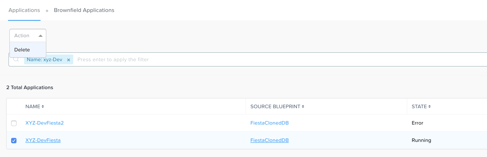

++++++++++
Cleanup
++++++++++

**Congratulations on completing the Nutanix databases lab track!**

.. note::

   Please be respectful and cautious when cleaning up VMs so as not to delete another user's resources.

After you have validated all completed labs with a proctor, please free up memory and IP resources on your cluster by doing the following:

- Do **NOT** delete your *Initials*\ **-WinToolsVM** or *Initials* **-LinuxToolsVM** VMs as they can be re-purposed in other labs
- Power off your *Initials*\ **-MSSQL**, *Initials*\ **-MSSQL2**, *Initials*\ **-MSSQL2\_<Timestamp>**, *Initials*\ **-clusterdb-1**, and *Initials*\ **-clusterdb-2** VMs in **Prism**
- Delete your *Initials* **-Fiesta** and *Initials*\ **-DevFiesta** deployments in Calm to clean up your **nodereact** VMs

