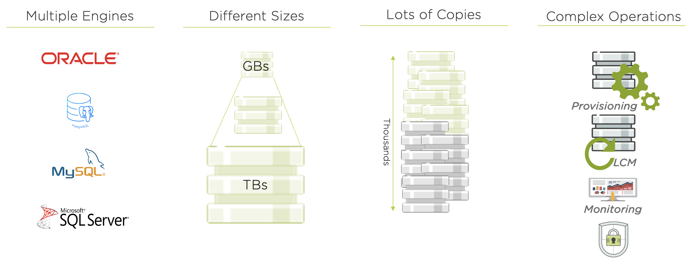
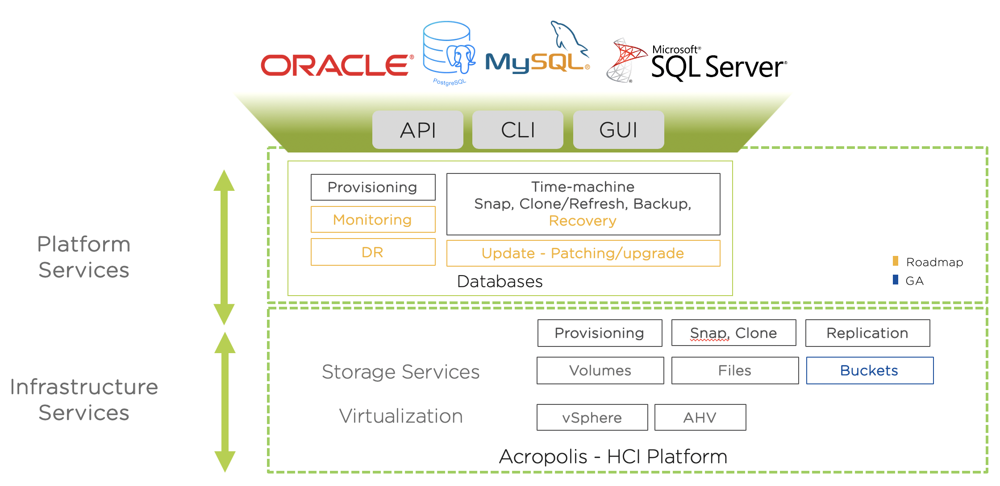

.. _dbgettingstarted:

----------------------
Getting Started
----------------------

Welcome to the Databases lab track. This track is meant to provide you with first hand experience in why Nutanix is an ideal platform for Database workloads.

Historically, it has been a challenge to virtualize SQL Server because of the high cost of traditional virtualization stacks and the impact that a SAN-based architecture can have on performance. Businesses and their IT departments have constantly fought to balance cost, operational simplicity, and consistent predictable performance.

The Nutanix Enterprise Cloud removes many of these challenges and makes virtualizing a business-critical application such as SQL Server much easier. The Acropolis Distributed Storage Fabric (DSF) is a software-defined solution that provides all the features one typically expects in an enterprise SAN, without a SAN’s physical limitations and bottlenecks. SQL Server particularly benefits from the following DSF features:

- Localized I/O and the use of flash for index and key database files to lower operation latency.
- A highly distributed approach that can handle both random and sequential workloads.
- The ability to add new nodes and scale the infrastructure without system downtime or performance impact.
- Nutanix data protection and disaster recovery workflows that simplify backup operations and business continuity processes.

In addition to solving common infrastructure problems for hosting business critical applications, Nutanix also seeks to address many of the key pain points associated with managing databases.

Based on a 2018 IDC study of 500 North American companies with more than 1,000 employees, they estimate:

- 77% of the organizations have more than 200 database instances in their production
- 82% have more than 10 copies of each DB
- 45%-60% the total storage capacity is dedicated to accommodating copy data
- 32% of database clones require daily refreshes for analytics of dev/test
- Copy data will cost IT organizations $55.63 billion in 2020

Maintaining the status quo leads to inefficient usage of both storage and worse, of administrator time. Meet Nutanix Era.

Nutanix Era provides DBaaS for your Enterprise Cloud. Leveraging the Nutanix Enterprise Cloud OS, we are able to take advantage of the power of full stack - data, compute, and software. Nutanix Era hides the complexity of database operations and provides common APIs, CLI, and consumer-grade GUI experience for multiple database engines. It makes database operations such as cloning efficient, thereby driving down the TCO of database management for our customers.

In this track you'll walk in an administrator's shoes to manually deploy a Microsoft SQL database VM on AHV, and observe first hand how Day 1 and Day 2+ management of that workload can be transformed with Nutanix Era. You'll also experience how Era can be used to provisioning and patch Oracle environments. In addition to Era, you'll see how additional products like Flow and Prism Pro complement database workloads on Nutanix.

If you have not previously completed the **Private Cloud** lab track, follow the quick instructions below to provision your user VLAN and Windows Tools VM that will be used throughout this lab track.

Configuring your User VLANs
+++++++++++++++++++++++++++

Typically, Hosted POC clusters provide 2x /25 VLANs. In order to provide adequate IP space and support lab requirements for Global Tech Summit, each cluster has been assigned an additional 8x /27 VLANs. The following instructions will walk you through configuring the VLAN you have been individually assigned, and should be used for the remaining labs in this track.

   .. note:: A /27 VLAN provides 32 IP addresses, 5 of which are reserved. You will therefore need to be conscious of cleaning up unneeded VMs to avoid running out of IP space.

#. Log into **Prism Central** using the following credentials:

   - **User Name** - admin
   - **Password** - emeaX2020!

#. Select :fa:`bars` **> Virtual Infrastructure > Subnets**.

#. Click **Network Config**, select *Your Assigned Cluster*, and click **OK**.

#. Click **+ Create Network** and fill out the following fields:

   - **Name** - *Refer to*  :ref:`clusterassignments` (e.g. User1 - **DO NOT USE THE EraManaged NETWORK, THIS IS CREATED IN A LATER LAB**)
   - **VLAN ID** - *Refer to*  :ref:`clusterassignments`
   - Select **Enable IP Address Management**
   - **Network IP Address / Prefix Length** - *Refer to*  :ref:`clusterassignments`
   - **Gateway IP Address** - *Refer to*  :ref:`clusterassignments`
   - **Domain Name Servers** - *Refer to*  :ref:`clusterassignments`
   - **Domain Search** - ntnxlab.local
   - **Domain Name** - ntnxlab
   - Select **+ Create Pool**
   - **Start Address** - *Refer to*  :ref:`clusterassignments`
   - **End Address** - *Refer to*  :ref:`clusterassignments`
   - Click **Submit**

   .. figure:: images/1.png

#. Click **Save**.

Configuring a Project
+++++++++++++++++++++

In this lab you will leverage multiple pre-built Calm Blueprints to provision your applications. In order to launch Blueprints you must first create a project.

.. raw:: html

  <strong>It is important to create the project through Calm as instructed below, and NOT directly though Administration > Projects in Prism Central.</strong>

#. In **Prism Central**, select :fa:`bars` **> Services > Calm**.\

#. Select **Projects** from the lefthand menu and click **+ Create Project**.

   .. figure:: images/2.png

#. Fill out the following fields:

   - **Project Name** - *Initials*\ -Project
   - Under **Users, Groups, and Roles**, select **+ User**
      - **Name** - Administrators
      - **Role** - Project Admin
      - **Action** - Save
   - Under **Infrastructure**, select **Select Provider > Nutanix**
   - Click **Select Clusters & Subnets**
   - Select *Your Assigned Cluster*
   - Under **Subnets**, select **Primary**, **Secondary**, and *Your Assigned User VLAN*, and click **Confirm**
   - Mark *Your Assigned User VLAN* as the default network by clicking the :fa:`star`

   .. figure:: images/3.png

#. Click **Save & Configure Environment**.

.. note:: You do not need to complete configuration of any of the Environment fields after saving the Project.

Deploying a Windows Tools VM
++++++++++++++++++++++++++++

Some exercises in this track will depend on leveraging the Windows Tools VM. Follow the below steps to provision your personal VM from a disk image.

#. In **Prism Central**, select :fa:`bars` **> Virtual Infrastructure > VMs**.

#. Click **+ Create VM**.

#. Fill out the following fields to complete the user VM request, using the **User** specific network details in :ref:`clusterassignments`:

   - **Name** - *Initials*\ -WinToolsVM
   - **Description** - Manually deployed Tools VM
   - **vCPU(s)** - 2
   - **Number of Cores per vCPU** - 1
   - **Memory** - 4 GiB

   - Select **+ Add New Disk**
      - **Type** - DISK
      - **Operation** - Clone from Image Service
      - **Image** - WinToolsVM.qcow2
      - Select **Add**

   - Select **Add New NIC**
      - **VLAN Name** - *Assigned User VLAN*
      - Select **Add**

#. Click **Save** to create the VM.

#. Power on your *Initials*\ **-WinToolsVM**.
