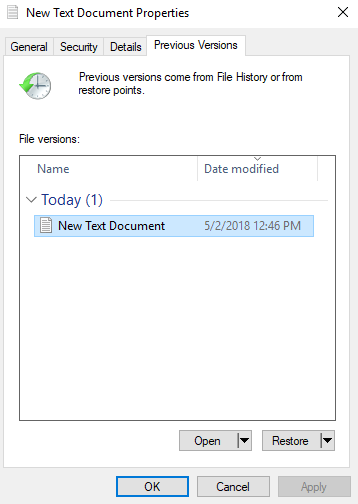

.. _citrixfiles:

-------------------------------
User Personalization with Files
-------------------------------

As mentioned in :ref:`citrixnpdesktops`, a key challenge in rolling out non-persistent desktops is ensuring you can still deliver the appropriate level of user customization based on use case. While there are multiple 3rd party solutions that exist in the EUC space, Citrix offers multiple out of the box options, including Citrix User Profile Management (UPM) and Citrix User Personalization Layers (UPL). Both of these solutions require file servers to host profiles and layers.

In addition to user customization, user's also require external storage for their files - as saving things to a non-redirected Desktop folder on a non-persistent desktop is a recipe for data loss!

Nutanix Files introduces a software defined approach of delivering native, distributed file services for EUC environments. No more separate NAS infrastructure to manage, Files can even be deployed on the same infrastructure as your virtual desktops themselves!

**In this lab you will configure Nutanix Files to provide user profiles and data storage for your non-persistent Citrix desktops.**

Creating Profiles Share
+++++++++++++++++++++++

For the purposes of saving time and resources, a Nutanix Files instance has already been deployed to your cluster. For a quick overview on how Nutanix Files can be deployed in minutes, click `here <https://www.youtube.com/watch?v=gJagnILsd94>`_.

#. In **Prism Element > File Server > Share/Export**, click **+ Share/Export**.

   .. figure:: images/1.png

#. Under **Basic**, fill out the following fields and click **Next**:

   - **Name** - *Initials*\ **-CitrixProfiles**
   - **Description** - User profiles and data
   - **File Server** - BootcampFS
   - **Select Protocol** - SMB

   .. note::

      As this environment leverages a single-node Files deployment, you are not given the option between **Standard** and **Distributed** share types. <Info on profiles and distributed share - optimizes the sharding of data for this use case by distributing users' home directories evenly across all VMs in the AFS cluster.>

#. Fill out the following fields and click **Next > Create**:

   - Select **Enable Access Based Enumeration (ABE)**
   - Select **Self Service Restore**
   - Select **Blocked File Types** - .mp3,.mp4

   .. figure:: images/13.png

   .. note::

     Access Based Enumeration (ABE) is a Microsoft Windows (SMB protocol) feature which allows the users to view only the files and folders to which they have read access when browsing content on the file server.

     Self Service Restore enabled support for Windows Previous Versions on an SMB share.

     Either of these features can be enabled/disabled on a per share basis.

.. #. Repeat **Steps 1-3** to create an additional Share named *Initials*\ **-DepartmentShare**, without any Blocked File Types.

   .. figure:: images/14.png

#. In **Prism Element > File Server > File Server**, select **BootcampFS** and click **Protect**.

   .. figure:: images/2.png

     Observe the default Self Service Restore schedules, this feature controls the snapshot schedule for Windows' Previous Versions functionality. Supporting Windows Previous Versions allows end users to roll back changes to files without engaging storage or backup administrators. Note these local snapshots do not protect the file server cluster from local failures and that replication of the entire file server cluster can be performed to remote Nutanix clusters.

#. From your *Initials*\ **-WinTools** VM, validate you can access ``\\BootcampFS.ntnxlab.local\Initials-CitrixProfiles\`` from File Explorer.

   .. figure:: images/3.png

   .. note::

     To learn more about Files capabilities, including Quotas, Antivirus integration, monitoring, and more, see the `Nutanix Files Guide <https://portal.nutanix.com/#/page/docs/details?targetId=Files-v3_6:Files-v3_6>`_ on the Nutanix Portal.

Configuring Share Permissions
+++++++++++++++++++++++++++++

Managing access control for Files SMB shares is still performed natively through Windows. In this exercise you'll configure permissions on your share to allow for any user to create a top level directory, which they then own, within the share. As users log in to their virtual desktops, a folder created based on their AD username will be automatically created.

#. From your *Initials*\ **-WinTools** VM, open ``\\BootcampFS.ntnxlab.local\`` in File Explorer.

#. Right-click your share and select **Properties**.

   .. figure:: images/4.png

#. Select the **Security** tab and click **Advanced**.

#. Select the default **Users (BootcampFS\\Users)** entry and click **Remove**.

#. Click **Add**.

#. Click **Select a principal** and specify **Everyone** in the **Object Name** field. Click **OK**.

#. Fill out the following fields and click **OK**:

   - **Type** - Allow
   - **Applies to** - This folder only
   - Select **Read & execute**
   - Select **List folder contents**
   - Select **Read**
   - Select **Write**

   .. figure:: images/5.png

#. Click **OK > OK > OK**.

   .. figure:: images/6.png

Configuring Citrix User Profile Management
++++++++++++++++++++++++++++++++++++++++++

UPM runs as a system service installed as part of the Virtual Delivery Agent within the virtual desktop or XenApp server. While similar to Microsoft Roaming Profiles, it offers key advantages such as faster logons by streaming the profile on-demand, administrative controls to limit profile size, and detailed logging.

In this exercise you will enable UPM through the Citrix Policy engine, similar to Microsoft Group Policy.

#. In **Citrix Studio > Policies**, right-click **Policies > Create Policy**.

   .. figure:: images/7.png

#. Select **Profile Management > Basic Settings** from the **All Settings** drop down menu. Optionally you can filter for only policies supported on **1912 Single-Session OS** from the **All Versions** drop down menu.

   .. figure:: images/8.png

#. Search for **Enable Profile management** and click **Select**. Select **Enabled** and click **OK**.

   .. figure:: images/9.png

#. Search for **Path to user store** and click **Select**. Select **Enabled** and specify ``\\BootcampFS\Initials-CitrixProfiles\%USERNAME%\!CTX_OSNAME!!CTX_OSBITNESS!`` as the path. Click **OK**.

   .. figure:: images/10.png

   .. note::

     The specified path will not only create unique top level directories within the share for each user, but will also create a platform specific subdirectory for their profile to avoid incompatability issues, such as trying to apply a Windows 10 user profile to a Windows 2012 session.

#. Click **Next**.

#. Click **Assign** to the right of **Delivery Group**.

#. Select your Non-Persistent Delivery Group from the **Delivery Group** drop down menu. Click **OK**.

   .. figure:: images/11.png

   .. note::

     Studio offers many different means of applying policies. Across a more diverse environment it may make sense to configure UPM settings based on OUs or Tags.

#. Click **Next**.

#. Provide a friendly **Policy name** (e.g. *Initials*\ **-UPM**) and select **Enable policy**. Review your configuration and click **Finish**.

   .. figure:: images/12.png

Testing Profiles and Folder Redirection
+++++++++++++++++++++++++++++++++++++++

#. From your *Initials*\ **ToolsVM**, open http://ddc.ntnxlab.local/Citrix/NTNXLABWeb, login as **NTNXLAB\\operator02** and connect to a **Pooled Windows 10 Desktop**.

#. Within your virtual desktop, make some simple changes such as adding files to your Documents folder. Note the hostname of the desktop to which you are connected.

   .. figure:: images/afsprofiles15.png

#. Open **PowerShell** and try to create a file with a blocked file type by executing the following command:

   .. code-block:: PowerShell

      New-Item \\BootcampFS\INITIALS-CitrixProfiles\operator02\Win10RS6x64\UPM_Profile\Documents\test.mp3

   Observe that creation of the new file is denied.

#. Sign out of the **Pooled** desktop. Do not just close the Citrix Workspace session as the desktop will not be re-provisioned.

#. Again, log in to Citrix StoreFront as **NTNXLAB\\operator02** and connect to a **Pooled Windows 10 Desktop**. Note that your files and settings persist across sessions, despite the underlying desktop being freshly provisioned every time you log in.

#. Open ``\\BootcampFS\Initials-CitrixProfiles\operator02`` in **File Explorer**. Drill down into the directory structure to find the data associated with your user profile.

#. Sign out of your virtual desktop. **Do not simply disconnect or close the Citrix Workspace App**.

#. Log in to Citrix StoreFront as **NTNXLAB\\operator01** and connect to a **Pooled Windows 10 Desktop**. Open ``\\BootcampFS\Initials-CitrixProfiles\`` and note that you don't see or have access to **operator02**'s profile directory. Disable **Access Based Enumeration (ABE)** in **Prism > File Server > Share/Export > home > Update** and try again.

#. (Optional) Create and save a text file in the **Documents** folder of your non-persistent virtual desktop. After ~1 hour, return to your virtual desktop, modify and save the document you previously created. Right-click the file and select **Restore previous versions**. Select an available previous version of the document and click **Open** to access the file.

(Optional) Using Files with Citrix User Personalization Layers
++++++++++++++++++++++++++++++++++++++++++++++++++++++++++++++

The Citrix UPL feature of Citrix Virtual Apps and Desktops (VAD) extends capabilities of non-persistent Windows 10 desktops by preserving data and locally user installed applications (UIA) across sessions.  Citrix UPL is the same technology as App Layering User Layers but is integrated into the Citrix Virtual Delivery Agent (VDA) and uses the Citrix policy engine.  Citrix UPL has all the features and functionality of User Layers (UL) without having to go through the entire App Layering process or having to deploy the Enterprise Layering Manager (ELM) virtual appliance.

.. note::

   All applications the user installs locally in the virtual desktop are supported in Citrix UPL, except for the following items:

   - Enterprise applications, such as Microsoft Office and Visual Studio
   - Applications that modify network stack or hardware, such as a VPN client
   - Applications that have boot level drivers, such as antivirus programs
   - Applications that have drivers that use the driver store, such as a printer driver

   Instead of having the user install the applications listed above locally in the virtual desktop as part of their UPL, install these applications in the master image.

   Any applications that attempt to add or edit local users or groups will not have the changes persist.  Instead add any required local users or groups to the master image.

   For full requirements and recommendations, see `Citrix Product Documentation on Citrix Virtual Apps and Desktops User Personalization Layer <https://docs.citrix.com/en-us/citrix-virtual-apps-desktops/install-configure/user-personalization-layer.html>`_.

#. Return to **Prism Element > File Server > Share/Export**, click **+ Share/Export**.

#. Under **Basic**, fill out the following fields and click **Next**:

   - **Name** - *Initials*\ **-CitrixUPL**
   - **Description** - Citrix UPL storage
   - **File Server** - BootcampFS
   - **Select Protocol** - SMB

#. Click **Next > Create**.

#. From your *Initials*\ **-WinTools** VM, open ``\\BootcampFS.ntnxlab.local\`` in File Explorer.

#. Open your *Initials*\ **-CitrixUPL** share and create a new directory named **Users**.

   .. figure:: images/15.png

   .. note::

      The folder name is hard coded in Citrix UPL and must be named **Users**.

#. Return to **Citrix Studio > Policies**. Right-click your **UPM** policy and select **Disable**.

   You will be applying your UPL policy to the same group of desktops.

#. Click **Create Policy**.

#. Specify **User Layer** in the **Search** field to filter for the required settings.

   .. figure:: images/16.png

#. Select **User Layer Repository Path** and specify the path to your *Initials*\ **-CitrixUPL** share. Do not include the **Users** folder in the path, this will be appended automatically. Click **OK**

   .. figure:: images/17.png

#. Select **User Layer Size in GB** and specify a value of **20** GB. Click **OK**.

   .. note:: The default value of 0 will configure 10GB UPL disks.

#. Click **Next**.

#. Click **Assign** to the right of **Delivery Group**.

#. Select your Non-Persistent Delivery Group from the **Delivery Group** drop down menu. Click **OK**.

   .. figure:: images/11.png

   .. note::

      Citrix UPL works with Pooled-Random and Pooled-Static Machine Catalogs. Citrix UPL does not support Pooled-Static Machine Catalogs with Citrix Personal vDisk (now deprecated) or dedicated, persistent machines that save changes to local disk.

#. Click **Next**.

#. Provide a friendly **Policy name** (e.g. *Initials*\ **-UPL**) and select **Enable policy**. Review your configuration and click **Finish**.

#. From your *Initials*\ **ToolsVM**, open http://ddc.ntnxlab.local/Citrix/NTNXLABWeb, login as **NTNXLAB\\operator03** and connect to a **Pooled Windows 10 Desktop**.

#. Open ``\\BootcampFS.ntnxlab.local\<Initials>-CitrixUPL\Users`` in File Explorer and note there is now a directory for your user containing a VHD with your personal desktop layer.

   .. figure:: images/18.png

#. Download and install **Mozilla Firefox** on your desktop. Launch Firefox and configure as your default browser.

#. Restart your virtual desktop.

#. After ~2 minutes, return to Citrix StoreFront and launch another **Pooled Windows 10 Desktop**. Observe that Firefox in still installed and configured as your default browser. Launch Firefox and note that the initial setup does not run again, as it has saved the settings from the previous session.

   .. figure:: images/19.png

#. Disconnect from your virtual desktop.

Takeaways
+++++++++

- Nutanix Files provides native files services suitable for storing user profile, data, and Citrix User Personalization Layer VHD files.

- Citrix User Personalization Layer is a simplified version of App Layering User Layers for non-persistent Provisioning and Machine Creation Services images.

- Nutanix Files can be deployed on the same Nutanix cluster as your Citrix virtual desktops, resulting in better utilization of storage capacity and eliminating additional storage silos.

- Supporting mixed workloads (e.g. virtual desktops and file services) is further enhanced by Nutanix's ability to mix different node configurations within a single cluster, such as:

  - Mixing storage heavy and compute heavy nodes
  - Expanding a cluster with Storage Only nodes to increase storage capacity without incurring additional virtualization licensing costs
  - Mixing different generations of hardware (e.g. NX-3460-G6 + NX-6235-G5)
  - Mixing all flash nodes with hybrid nodes
  - Mixing NVIDIA GPU nodes with non-GPU nodes
