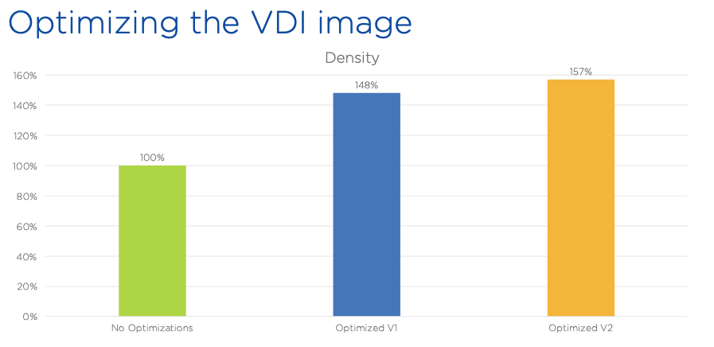

.. _citrixgoldimage:

------------------------------------
Building & Optimizing the Gold Image
------------------------------------

When we install a vanilla client operating system, we need to keep in mind that this OS was built for physical devices (i.e. laptops and desktops), with direct attached devices and limited noisy neighbor effects. If we install that same OS in a VM we might see different results, hence the need for optimization. The Nutanix Performance/Solutions Engineering team for EUC has tested various optimizations and the lab, and validated the following results:

As you can see there’s a 48% improvement of desktop density per node when applying baseline Citrix optimizations, and increases to 57% with a second pass using VMware OS optimization recommendations. Note that both sets of optimizations are independent of underlying hypervisor, and rather tune services within the OS guest.

**In this lab you will install the Citrix Virtual Desktop Agent within the VM migrated from your vSphere environment, and optimize the VM using both the Citrix Optimizer and VMware OS Optimization Tool.**

Deploying a VM
++++++++++++++

If you completed the :ref:`move` lab, skip to CtxPausingUpdates_. Otherwise, follow the steps below to provision a VM to begin building your gold image.

#. In **Prism Central**, select :fa:`bars` **> Virtual Infrastructure > VMs**.

   .. figure:: images/1.png

#. Click **Create VM**.

#. Select your assigned cluster and click **OK**.

#. Fill out the following fields:

   - **Name** - *Initials*\ -GoldImage
   - **Description** - (Optional) Description for your VM.
   - **vCPU(s)** - 2
   - **Number of Cores per vCPU** - 1
   - **Memory** - 4 GiB

   - Select **+ Add New Disk**
       - **Type** - DISK
       - **Operation** - Clone from Image Service
       - **Image** - Win10v1903.qcow2
       - Select **Add**

   - Select **Add New NIC**
       - **VLAN Name** - *User Assigned VLAN*
       - Select **Add**

#. Click **Save** to create the VM.

#. Select your Move VM and click **Power On**.

.. _CtxPausingUpdates:

Pausing Updates
+++++++++++++++

Before starting to build your **Windows 10** image it is important the ensure that no Windows Updates are in progress, as this can cause issues with cloning.

#. Open the VM console or connect via RDP.

   - **User Name** - Nutanix
   - **Password** - nutanix/4u

#. Open **System Settings > Windows Update** and click **Pause Updates for 7 Days**.

   .. figure:: images/24.png

#. Restart the VM.

Installing the VDA
++++++++++++++++++

The Virtual Delivery Agent (VDA) is a collection of drivers and services installed on each physical or virtual machine available for user connection. The VDA allows the machine to register with the Delivery Controller, allowing the Delivery Controller to assign those resources to users. The VDA is also responsible for establishing the HDX connection, the Citrix remoting protocol, between the machine and the user device, verifying licensing, and applying Citrix Policy.

#. Once the VM has restarted, reconnect to the VM console or connect via RDP.

#. Change the **Computer Name** (e.g. *Initials*\ -GoldImage) and join the **NTNXLAB.local** domain using the following credentials:

   - **User Name** - NTNXLAB\\Administrator
   - **Password** - nutanix/4u

   .. figure:: images/1b.png

   .. note::

      Open **Control Panel > System and Security > System > Change Settings** to access the traditional Windows domain join field in Windows 10.

#. Restart your VM and log in using the following credentials:

   - **User Name** - NTNXLAB\\Administrator
   - **Password** - nutanix/4u

#. In **Prism Central**, select your GoldImage VM and click **Actions > Update**.

   .. figure:: images/2.png

#. Under **Disks > CD-ROM**, select :fa:`pencil` and fill out the following fields:

   - **Operation** - Clone from Image Service
   - **Image** - Citrix_Virtual_Apps_and_Desktops_7_1912.iso

#. Click **Update > Save**.

#. Within the VM console, open **D:\\AutoSelect.exe** to launch the Citrix installer.

   .. figure:: images/3.png

#. Select **Virtual Apps and Desktops > Start**.

   .. figure:: images/4.png

#. Select **Prepare Machines and Images** to begin installation of the Virtual Desktop Agent.

   .. figure:: images/5.png

#. Select **Create a MCS master image** and click **Next**.

   .. figure:: images/6.png

#. Under **Core Components**, select **Citrix Workspace App** in addition to the default **Virtual Desktop Agent** selection. Click **Next**.

   .. figure:: images/6b.png

#. Under **Additional Components**, select **Citrix User Personalization Layer** in addition to the default selections, and click **Next**.

   .. figure:: images/7.png

#. Under **Delivery Controller**, select **Let Machine Creation Services do it automatically** from the drop down, and click **Next**..

   .. figure:: images/8.png

# Under **Features**, click **Next**.

   .. figure:: images/9.png

   <info about default optimizations>

#. Allow the installer to automatically configure required Windows Firewall port accessibility, click **Next**.

#. Click **Install** to begin the VDA installation. This process should take approximately 5 minutes.

#. When prompted, de-select **Collect diagnostic information** for Citrix Call Home and click **Next**.

   .. figure:: images/10.png

#. Click **Finish** and wait for the VM to restart.

Running Citrix Optimizer
++++++++++++++++++++++++

#. Within the VM console, download http://10.42.194.11/workshop_staging/CitrixOptimizer.zip and extract to a directory.

#. Right-click **CitrixOptimizer.exe** and select **Run as Administrator**.

   .. figure:: images/12.png

#. Select the recommended optimization template based on the Windows build being used for the gold image.

   .. figure:: images/13.png

#. Click **Select All** to select all available optimizations and click **Analyze**.

   .. figure:: images/14.png

#. Click **View Results** to see a detailed report of the status of each available optimization.

#. Return to the **Citrix Optimizer** and click **Done > Optimize** to apply the selected optimizations.

   .. figure:: images/15.png

#. Once the tool has completed, you can click **View Results** to view an updated report. You can now close the tool.

Running VMware OS Optimization Tool
+++++++++++++++++++++++++++++++++++

#. Within the VM console, download http://10.42.194.11/workshop_staging/VMwareOSOptimizationTool.zip and extract to a directory.

#. Right-click **VMwareOSOptimizationTool.exe** and select **Run as Administrator**.

#. Click the **Select All** checkbox. Scroll down to **Cleanup Jobs** and un-select the 4 available optimizations. Click **Analyze**.

   .. figure:: images/16.png

   .. note::

      The Cleanup Jobs are excluded from this exercise as they can be time consuming to apply.

#. Note the outstanding optimizations not applied in the **Analysis Summary** pane.

   .. figure:: images/17.png

#. Click **Optimize** to apply the remaining optimizations.

   .. figure:: images/18.png

#. Review the results and then restart your Gold Image VM.

Completing the Gold Image
+++++++++++++++++++++++++

XenDesktop provisions pools of desktops based on a hypervisor snapshot of the gold image. Unlike traditional hypervisors which can experience performance degradation from traversing long snapshot chains, Nutanix's redirect-on-write algorithm for implementing snapshots has no such drawback. This difference allows for flexibility in using gold image snapshots to maintain many gold image versions from a single VM. Watch `this video <https://youtu.be/uK5wWR44UYE>`_ for additional details on how Nutanix implements snapshots and cloning.

#. Once restarted, Perform a graceful shutdown of the VM from within the guest.

#. From **Prism Element**, take a snapshot of the VM (e.g. *Post optimization and VDA install*)

   .. figure:: images/20.png

   .. note::

      This snapshot **must** be taken from Prism Element in order to be recognized by the Citrix AHV plug-in.

Takeaways
+++++++++

What are the key things learned in this exercise?

- The gold VM does not require Sysprep or being domain joined.

- Using MCS helps simplify the gold image by not having to manually specify (or depend on Active Directory to specify) what XenDesktop Delivery Controller(s) with which the image should attempt to register. This allows more flexibility in having a single gold image support multiple environments without external dependencies.

- EUC image optimization tools are not solution or hypervisor specific and can be easily applied to improve virtual desktop performance and increase host density.
