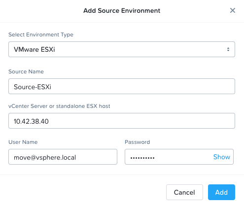

.. _move:

-----------------------------------
Migrating Horizon View Image to AHV
-----------------------------------

It's a cool afternoon in late February, you look longingly over your cubicle wall towards the windows in the distance, and see a group of birds perched along a tree branch. What beautiful music they must be making. It's a shame you're stuck inside, still fighting performance issues in your Horizon View environment, running on blade server and fibre channel SAN infrastructure. Next week you're expected to add 100 additional desktops to the pool, you have the compute, but your storage is at peak utilization and further increases in latency will inevitably result in an increase in user complaints lobbed at the helpdesk.

In your minimal spare time, you've tried getting a Citrix pilot off the ground, but management can't justify the Citrix licensing cost in addition to the VMware licenses that would be required for expansion of the corporate VDI environment...

**In this lab you will deploy and use the freely available Nutanix Move to migrate your existing Horizon View gold image from vSphere to Nutanix AHV, and use it as the basis for a Citrix gold image.**

.. raw:: html

   <strong>If you are already familiar with using Move to migrate VMs from ESXi to AHV, you can proceed to the next lab and follow the instructions to provision a gold image VM from a disk image on your AHV cluster.</strong>

Deploying Move
++++++++++++++++

Move is a .qcow2 virtual appliance, similar to other Nutanix tools. It is distributed as a .zip package and can be downloaded from the `Nutanix Support Portal <https://portal.nutanix.com/#/page/NutanixMove>`_. The .zip package includes the .qcow2 disk image, as well as command line tools for Windows, macOS, and Linux that can be used to script the deployment and IP assignment of the Move VM.

In this exercise, you will deploy Move from a disk image that has already been populated on your Nutanix cluster. **It is not necessary to download the Move package from the Support Portal.**

#. In **Prism Central**, select :fa:`bars` **> Virtual Infrastructure > VMs**.

   .. figure:: images/1.png

#. Click **Create VM**.

#. Select your assigned cluster and click **OK**.

#. Fill out the following fields:

   - **Name** - *Initials*\ -Move
   - **Description** - (Optional) Description for your VM.
   - **vCPU(s)** - 2
   - **Number of Cores per vCPU** - 2
   - **Memory** - 4 GiB

   - Select **+ Add New Disk**
       - **Type** - DISK
       - **Operation** - Clone from Image Service
       - **Image** - move-3.4.1.qcow2
       - Select **Add**

   - Select **Add New NIC**
       - **VLAN Name** - Secondary
       - Select **Add**

#. Click **Save** to create the VM.

#. Select your Move VM and click **Power On**.

#. In **Prism Central > VMs > List**, identify the IP address assigned to your Move VM using the **IP Addresses** column.

   .. note::

     By default, the Move appliance will obtain an IP address via DHCP. If a static IP address is required, it can be configured via the local Move VM console by following the instructions `here <https://portal.nutanix.com/#/page/docs/details?targetId=Nutanix-Move-v34:v34-assign-ip-addresses-t.html>`_.

#. Open \https://*Move-VM-IP*/ in a new browser tab.

#. Accept the End User License Agreement and provide a new password to log into the Move web interface (e.g. **emeaX2020!**).

#. Specify your new password and click **Log In**.

   .. figure:: images/2.png

Configuring a Target Environment
++++++++++++++++++++++++++++++++

The target environment is the Nutanix AHV cluster to which you plan to migrate VMs. A single Move deployment can support migrations between multiple source and target environments.

#. Under **Target Environments**, click **+ Add Target**.

#. Fill out the following fields and click **Add**:

   - **Environment Type** - Nutanix AOS
   - **Environment Name** - *Your Prism Central or Nutanix cluster name*
   - **Nutanix Environment** - *Your Prism Central or Prism Element IP*
   - **User Name** - admin
   - **Password** - emeaX2020!

   .. figure:: images/3.png

Move will confirm the specified PC/cluster can be accessed using the IP/FQDN and credentials provided.

.. note::

   Adding a Prism Central target has the added benefit of being able to target any clusters registered to that Prism Central.

Configuring a Source Environment
++++++++++++++++++++++++++++++++

The source environment is the AHV, ESXi, Hyper-V, or AWS environment from which you plan to migrate VMs.

#. Under **Source Environments**, click **+ Add Source**.

#. Fill out the following fields and click **Add**:

   - **Environment Type** - VMware ESXi
   - **Source Name** - Source-ESXi
   - (If using a PHX Cluster) **vCenter Server** - 10.42.38.40
   - (If using a RTP Cluster) **vCenter Server** - 10.55.76.40
   - **User Name** - move@vsphere.local
   - **Password** - emeaX2020!

Move will confirm vCenter can be accessed using the credentials provided, as well as validating the account has all of the required permissions.

Staging a Source VM
+++++++++++++++++++

#. In a new browser tab, open \https://*vCENTER-SERVER-IP*/ui/ and log in with the following credentials:

   - **User Name** - move@vsphere.local
   - **Password** - emeaX2020!

   .. figure:: images/5.png

#. In the **vSphere Client**, select the **VMs and Templates** icon.

   .. figure:: images/6.png

#. Under **Datacenter1 > Move Source VMs**, right-click **HorizonView-GoldImage** and select **New VM from This Template**.

   .. figure:: images/7.png

#. Fill out the following fields and click **Next**:

   - **Virtual machine name** - *Initials*\ -GoldImage
   - **Select a location** - Datacenter1 > Move Source VMs

   .. note::

      **IMPORTANT!** You must select the **Move Source VMs** folder, otherwise you will not be able to access your VM as the move@vsphere.local user.

   .. figure:: images/8.png

#. Select **Cluster 1** as the compute resource and click **Next**.

   .. figure:: images/9.png

#. Select the **vmContainer1** datastore and click **Next**.

   .. figure:: images/10.png

#. Select **Power on virtual machine after creation** and click **Next > Finish**.

   .. figure:: images/11.png

Migrating VMs
+++++++++++++

#. In the **Move** console, click **Create a Migration Plan**, enter a **Plan Name** (e.g. *Initials*\ -Migration), and click **Proceed**.

#. Select the shared ESXi environment under the **Select Source** drop down.

#. Select your assigned cluster as the **Target** (will be selected by default if the only target available).

#. Select the **Default** storage container as the **Target Container** for your cluster.

   .. figure:: images/13.png

   While a single Move deployment can support migrations between multiple source and target environments, only a single source and target can be used in an individual Migration Plan.

#. Click **Next**.

#. Click the :fa:`plus-circle` icon to add your VM to the migration plan. Multiple VMs can be migrated as part of a single Migration Plan.

   .. figure:: images/14.png

   .. note::

      You may need to click **Refresh** for your VM to appear.

#. Click **Next**.

#. Map the **Source Network** to a **Target Network** (e.g. your *User Assigned VLAN*) and click **Next**.

   By default, **Automatic** Preparation Mode is selected. VM Preparation refers to installing the **virtio** drivers within the source VM prior to migration beginning. The **virtio** drivers provide a high performance I/O interface for disk and network devices on KVM, and allow VMs that were originally deployed on an alternate hypervisor to boot on AHV.

   .. note::

     While Move installs **virtio** drivers, it does **not** install the full Nutanix Guest Tools (NGT) package.

   .. note::

    VMs can be manually prepared by an administrator if they wish to avoid providing Move with guest credentials to allow for automatic installation of **virtio** drivers. Automatic preparation requires that UAC be disabled for Windows VMs to perform guest operations, or using the built-in Administrator account.

#. Fill out the following fields and click **Next**:

   - **Windows VM User Name** - Nutanix
   - **Windows VM Password** - nutanix/4u

   .. figure:: images/15.png

   <Info on retaining mac addresses, data only migration, and seeding scheduling>

#. Click **Save and Start** to begin the migration.

#. Under **Migration Plans**, click **In Progress** to view to status of your migration.

   .. figure:: images/16.png

   An initial snapshot will be taken of the VM, at which point data based on that snapshot is transferred from the source and to the target cluster. As the VM can change (new data written, new applications installed, etc.) during data seeding, subsequent snapshots will be taken to continuously copy deltas to the target cluster.

   The initial **Seeding Data** process will take ~15 minutes to complete for the VM in this exercise. Time to seed in other environments will be dependent on the amount of source data and bandwidth.

   .. raw:: html

      <strong>You may proceed to the next lab and follow the instructions for provisioning a gold image VM using a disk image on your AHV cluster. Check on your Migration Plan status periodically and complete this exercise once data seeding has completed. YOU DO NOT NEED TO WAIT FOR MIGRATION TO COMPLETE TO MOVE ON TO THE NEXT LAB.</strong>  

   .. **You can now proceed to the next lab and return to Move once the Migration Status has reached Ready to Cutover**.

   Once a Migration plan has reached **Ready to Cutover** it will still continue to update data as changes are made on the source. This activity keeps the source and target close to being in sync to decrease downtime during cutover. Additionally, VMs can be selected on an individual basis for cutover to allow for flexibility and planning on any brief application outages.

#. Select your VM and click **Cutover**.

   .. figure:: images/17.png

   Note that proceeding will shutdown the source VM and disconnect any of its network connections. Why are these steps necessary?

#. Click **Continue**.

#. Return to the **vSphere Client** and validate that the source VM is being powered off. Move automates a graceful shutdown of the source VM and transfers the remaining delta data to the target environment. This process will take ~2-5 minutes.

   .. figure:: images/18.png

#. Once the final migration is completed, the migrated VM is powered on on the target AHV cluster. Click **View in Prism** and verify the VM is running and has obtained an IP address on the assigned target network.

   .. note::

      **IMPORTANT!** If your VM does not receive a 10.X.X.X IP address, remove the existing virtual NIC and add a new virtual NIC with your *User VLAN* VM Network.

#. To prepare for your Citrix or Frame gold image creation, launch the VM console and uninstall the **VMware Horizon Agent** and **VMware Tools**, then reboot your VM.

   .. figure:: images/19.png

#. In **Prism Central**, select your VM and click **Actions > Snapshot** to create a snapshot of your VM before proceeding to the next lab. The name of the snapshot should include your *Initials* for easy identification.

   .. note::

      This snapshot acts as a point to revert/clone your VM back to a clean state if you experience issues creating your gold image in the next exercise.

Next Steps
+++++++++

What are the key things you should know about **Nutanix Move**?

- Move is licensed at no cost for any Nutanix customer.

- Move for VMs simplifies bulk migration of existing VMs on ESXi, Hyper-V, and AWS to Nutanix AHV, eliminating the friction associated with onboarding new IT infrastructure.

- Move features the ability to migrate all AHV certified OSes, scheduling data-seeding and migrations, multi-cluster migration management, and grouping/sorting VMs.

Getting Connected
+++++++++++++++++

Have a question about **Nutanix Move**? Please reach out to the resources below:

+---------------------------------------------------------------------------------+
|  Move Product Contacts                                                          |
+================================+================================================+
|  Slack Channel                 |  #move                                         |
+--------------------------------+------------------------------------------------+
|  Product Manager               |  Jeremy Launier, jeremy.launier@nutanix.com    |
+--------------------------------+------------------------------------------------+
|  Technical Marketing Engineer  |  GV Govindasamy, gv@nutanix.com                |
+--------------------------------+------------------------------------------------+
