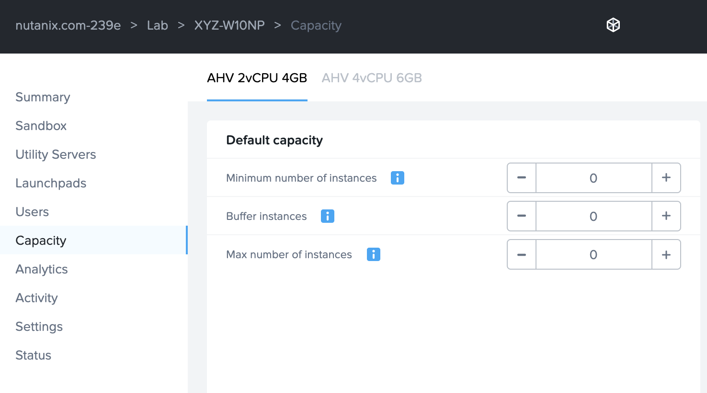

++++++++++
Cleanup
++++++++++

**Congratulations on completing the Nutanix End User Computing with Xi Frame lab track!**

.. note::

   Please be respectful and cautious when cleaning up VMs so as not to delete another user's resources.

After you have validated all completed labs with a proctor, please free up memory and IP resources on your cluster by doing the following:

- Delete your *Initials*\ **-GoldImage** VM in **Prism**
- Return to the Frame Portal, and under **Capacity**, decrease each value to **0** and click **Save** to de-provision your desktops

