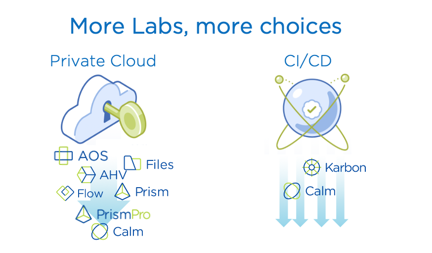

.. title:: Nutanix 

.. toctree::
   :maxdepth: 2
   :caption: Event Info
   :name: _info
   :hidden:

   info/clusterinfoprod
   info/clusteraccess

.. toctree::
   :maxdepth: 2
   :caption: Databases
   :name: _dbs
   :hidden:

   db/gettingstarted/gettingstarted
   db/mssqldeploy/mssqldeploy
   db/cloning/cloning
   db/aag/aag
   db/flow_secure_fiesta/flow_secure_fiesta
   db/flow_isolate_fiesta/flow_isolate_fiesta

.. toctree::
   :maxdepth: 2
   :caption: CI/CD Chain
   :name: _cicd
   :hidden:

   calm_karbon_cicd/calm_karbon_cicd

**Welcome!** to this Workshop hosted by Nutanix.

   :align: center

**Databases Track** - *The databases track is ideal for users looking to become more familiar with the benefits the core Nutanix platform, Era, Flow, and Prism Pro can deliver for an organizations most business critical workloads, including Microsoft SQL Server.*

**CI/CD Lab** - *This standalone lab will be to see how provisioning a CI/CD chain. How CI/CD can work with an integration between Jenkins, Gitea and Nutanix solutions like Karbon and Calm.*

.. raw:: html

  <strong>Before beginning any labs, review the following sections for important information regarding your lab specific lab environment:</strong>

- :ref:`clusteraccess` - *VPN configuration for accessing the Nutanix Hosted POC network*

