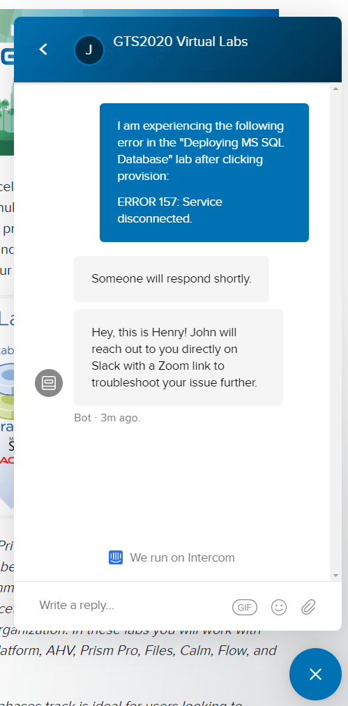

.. _emeahelp:

---------------
How To Get Help
---------------

If you are experiencing issues with a lab, **FIRST** ask your question in your region/language-specific Slack channel below. Each of these channels will be staffed by multiple users who have previously completed the labs and will be able to assist you with basic troubleshooting.

- **France** - `#emea-vgts-fr <slack://channel?team=T0252CLM8&id=CV9HSBML0>`_
- **German speaking** - `#emea-vgts-german <slack://channel?team=T0252CLM8&id=CUZFD2VEV>`_
- **METI** - `#emea-vgts-meti <slack://channel?team=T0252CLM8&id=CV94EMYPN>`_
- **NEEUR** - `#emea-vgts-neeur <slack://channel?team=T0252CLM8&id=CUZFFA48Z>`_
- **SEUR not France** - `#emea-vgts-seur-fr <slack://channel?team=T0252CLM8&id=CV9JA4YBF>`_
- **WEURSSA** - `#emea-vgts-weurssa <slack://channel?team=T0252CLM8&id=CUWQ20P8A>`_

If your issue cannot be addressed in your regional channel, you can escalate to get assistance from an expert by selecting the **Chat** icon at the bottom of any page within the NutanixWorkshops site.

Please provide a detailed description of your issue, including the name of the lab and any associated errors. An expert will then be dispatched to assist you via Slack or Zoom as soon as possible.

