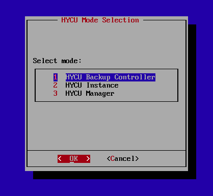
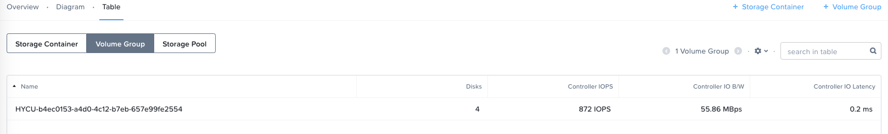

.. _hycu:

----
HYCU
----

*The estimated time to complete this lab is 60 minutes.*

Overview
++++++++

HYCU is the only solution built from the ground up to deliver a full suite of backup capabilities for Nutanix AHV and ESXi clusters, eliminating a key barrier to entry for AHV prospects. HYCU can be used to backup Nutanix VMs, Volumes, and Nutanix Files deployments.

As pure software, HYCU can help grow Nutanix deals as additional nodes are positioned to act as a backup target for workloads.

HYCU also fully supports non-Nutanix ESXi and Physical Windows Server environments, allowing customers migrating to Nutanix from legacy platforms a single backup solution. HYCU is able to backup the following Applications and File Services on Nutanix:

- Microsoft SQL Server (including failover and Availability Groups)
- Microsoft Exchange Server (including Database Availability Group (DAG))
- Microsoft Active Directory
- Oracle Database
- Nutanix Files
- Microsoft SQL Failover Cluster
- SAP HANA
- Nutanix Volume Groups

HYCU can be bundled with Nutanix's Secondary Storage Offering, Nutanix Mine

**In this lab you will deploy and configure a HYCU appliance and explore different workflows for backup and recovery of data within a Nutanix environment.**

Configuring HYCU Appliance
++++++++++++++++++++++++++

#. In **Prism > VM > Table**, click **+ Create VM**.

#. Fill out the following fields and click **Save**:

   - **Name** - *Initials*\ **-HYCU**
   - **vCPU(s)** - 4
   - **Number of Cores per vCPU** - 1
   - **Memory** - 4 GiB
   - Select **+ Add New Disk**

     - **Operation** - Clone from Image Service
     - **Image** - hycu-\*.qcow2
     - Select **Add**
   - Select **+ Add New Disk**

     - **Operation** - Allocate on Storage Container
     - **Storage Container** - Default
     - **Size (GiB)** - 32
     - Select **Add**
   - Remove **CD-ROM** Disk
   - Select **Add New NIC**

     - **VLAN Name** - Secondary
     - Select **Add**

#. Select the *Initials*\ **-HYCU** VM and click **Power on**.

   The CPU and memory resources of the backup appliance can be scaled up depending on the number of VM backups managed by HYCU. Complete sizing details are provided in the `HYCU User Guide <https://support.hycu.com/hc/en-us/sections/115001018365-Product-documentation>`_.

   The secondary disk added to the appliance is used as a data disk for the local HYCU database as well as maintenance operations. It is not used for storing VM backup data.

#. Click **Launch Console**.

#. Select **1 HYCU Backup Controller**

#. Fill out the following fields, highlight **OK** and press **Return**:

   - **Hostname** - *Initials*\ **-HYCU**
   - **IPv4 address** - *Specify the IP Assigned by IPAM DHCP*
   - **Subnet mask** - 255.255.255.128
   - **Default gateway** - *Secondary VLAN Gateway* (e.g. 10.XX.YY.129)
   - **DNS server** - *Your DC VM IP*
   - **Search domain** - ntnxlab.local

   .. note:: Switch fields by pressing the Tab key.

   .. figure:: images/1.png

   Wait approximately 1 minute for the internal database to initialize and backup controller services to start.

#. Note the default credentials and press **Return**. Close the **HYCU** VM console.

   .. figure:: images/2.png

Adding A Backup Source
++++++++++++++++++++++

HYCU provides tight integration with Nutanix clusters running either AHV or ESXi. Rather than relying on traditional hypervisor "stun" snapshots, HYCU speaks directly to the Nutanix Distributed Storage Fabric to determine changed blocks via API and leverage efficient `redirect-on-write snapshots <https://nutanixbible.com/#anchor-book-of-acropolis-snapshots-and-clones>`_.

If the cluster on which the HYCU virtual appliance is being deployed is a Nutanix Mine appliance, then the Nutanix Mine cluster needs to be added as both a source and target within HYCU. When deploying HYCU to a Mine appliance, the HYCU Dashboard can be deployed to the Prism Element of the cluster with one-click after adding the Nutanix Cluster as a Source.

#. Open \https://<*HYCU-VM-IP*>:8443/ in a browser. Log in to the **HYCU** HTML5 web interface using the default credentials:

   - **Username** - admin
   - **Password** - admin

#. From the toolbar, click :fa:`cog` **> Sources**.

   .. figure:: images/3.png

#. Click **+ New** and fill out the following fields:

   - **URL** - *Your Prism Element URL* (e.g. https://10.XX.YY.37:9440)
   - **User** - admin
   - **Password** - *Prism Element Password*

#. Click **Next**.

#. HYCU will validate the Nutanix cluster. Click **Save**

   .. figure:: images/4.png

#. After the job has been initiated, click **Close**.

   All jobs are launched asynchronously and can be tracked on the **Jobs** page.

   .. figure:: images/5.png

   .. note:: **A note about Nutanix Mine with HYCU** At this point, if this were a Nutanix Mine cluster, we could deploy the Mine prism dashboard to the cluster - to do so, we would highlight the Mine cluster under sources and click "Register with Prism" to deploy the HYCU dashboard to Prism. Because these are shared clusters here at Global Tech Summit, please **do not** deploy the Mine Prism dashboard to the cluster.

     .. figure:: images/6.png

     Deploying the HYCU dashboard to Prism Element will automatically restart the Prism Service on the cluster.

     .. figure:: images/7.png

#. From the **HYCU** sidebar, click :fa:`bars` **> Virtual Machines** and validate that your cluster's VMs are listed in the table.

Adding A Backup Target
++++++++++++++++++++++

The target is used for storing backups coordinated by HYCU. HYCU supports:
   - Nutanix
   - iSCSI (including Nutanix Volumes)
   - NFS (including Nutanix Files)
   - SMB (including Nutanix Files)
   - AWS, S3 (including Nutanix Buckets)
   - Azure
   - Google Cloud Platform (GCP)

In this exercise you will create a Nutanix Volume group to use as a target for VM backup data.
   - In a Nutanix Mine environment, the HYCU appliance and target storage would reside on the same cluster.
   - In a non-Mine production environment the HYCU appliance and target storage would not reside on the same cluster as the source VMs.

HYCU makes it incredibly easy to configure a Nutanix cluster (whether Mine or otherwise) as a target. After specifying Prism Element credentials, HYCU automatically configures a Volume Group with multiple vDisks and enables external iSCSI access.  The Volume Group is then formatted with XFS and allows data to be striped across the multiple underlying vDisks, thereby maximizing write performance, which in-turn helps minimize backup job times.  HYCU then leverages this Volume Group as a backup target.

.. note:: Prior to configuring a Nutanix target in HYCU, ensure the cluster has a Data Services IP configured

   .. figure:: images/8.png

#. From the **HYCU** sidebar, click :fa:`bars` **> Targets**.

#. Click **+ New**, fill out the following fields, and click **Save**:

   - **Name** - Nutanix-Target
   - **Concurrent Backups** - 4
   - **Description** - *Nutanix Cluster Name* HYCU-Target VG
   - **Type** - Nutanix
   - **URL** - *Your Prism Element URL* (e.g. https://10.XX.YY.37:9440)
   - **Username** - admin
   - **Password** - *Prism Element Password*

   .. figure:: images/9.png

Multiple backup targets can be added to support backup jobs.

.. note:: Nutanix storage container settings can be configured at this step. Follow Nutanix recommended best practice for backup workloads - as a general rule, hardware compression can be enabled, but deduplication should be left disabled. If the cluster has 4 or more nodes, consider enabling Erasure Coding.

#. The Target Deployment takes about 3 minutes to complete. You can monitor the progress in the "Jobs" menu within HYCU

#. HYCU automatically deploys a Volume Group. Once the target configuration completes, you can see the HYCU container and Volume Group deployed from within the cluster's Prism Element interface:

Configuring Backup Policies
+++++++++++++++++++++++++++

HYCU uses policies to define RPO, RTO, retention, and backup target(s), allowing for the easy application of these SLAs to groups of VMs.

#. From the **HYCU** sidebar, click :fa:`bars` **> Policies**.

   By default HYCU is configured with 4 different Policies:

   - **Gold** - 4 Hour RPO, 4 Hour RTO
   - **Silver** - 12 Hour RPO, 12 Hour RTO
   - **Bronze** - 24 Hour RPO, 24 Hour RTO
   - Exclude - Backup not required

#. To create a custom policy, click **+ New**.

#. Fill out the following fields and click **Save**:

   - **Name** - Fast
   - **Description** - 1 Hour RPO/RTO, Fast Restore Enabled (1 Week)
   - **Enabled Options** - Backup, Fast Restore
   - **Backup Every** - 1 Hours
   - **Recover Within** - 1 Hours
   - **Retention** - 4 Weeks
   - **Targets** - Automatically selected
   - **Backup Threshold** - 25%
   - **Fast Restore Retention** - 1 Weeks

   .. figure:: images/11.png

   HYCU supports multiple advanced configurations for backup policies, including:

   - **Backup Windows** - Allows an administrator to define granular time of day and day of week schedules to enforce backup policy.
   - **Copy** - Asyncronously copies data from the primary backup target to a configurable secondary backup target during periods of non-peak utilization.
   - **Archiving** - Allows an administrator to target slower, cold storage for long term retention of **full** backups.
   - **Fast Restore** - Retains and restores from local snapshots on the Nutanix cluster for rapid restore operations.
   - **Backup from Replica** - For VMs that use native Nutanix replication from a primary cluster to a secondary cluster, this feature will backup VMs from the replicated snapshots on the secondary cluster. This functionality can significantly reduce data movement for scenarios such as Remote Office Branch Office. It also removes the need for deployment of agents/proxies within the remote site.

   HYCU is also unique in its ability for administrators to define desired RTO. By specifying a desired **Recover Within** period and selecting **Automatic** target selection, HYCU will compute the right target to send the VM. The performance of the target is constantly monitored to ensure it can recover the data within the configured window. If a HYCU instance has several targets configured, a subset can be selected and HYCU will still intelligently choose between the selected targets.

#. Select the **Exclude** policy and click **Set Default > Yes**.

   .. figure:: images/12.png

   This will set the default policy for VMs to not be backed up by HYCU. In a production environment you could choose the appropriate policy to minimally backup all VMs by default. Any new VMs created on the source cluster(s) will automatically be applied the default policy.

Backing Up A VM
+++++++++++++++

In this exercise you will back up a Windows Server VM with a mounted iSCSI Volume Group. In-guest iSCSI disks are common in enterprise apps such as SQL Server that require shared storage for high availability.

.. note::
   It is recommended to connect to the *Initials*\ **-HYCUBackupTest** via RDP so you can copy/paste the initiator name (IQN).

#. In **Prism > VM > Table**, click **+ Create VM**.

#. Fill out the following fields and click **Save**:

   - **Name** - *Initials*\ -HYCUBackupTest
   - **vCPU(s)** - 2
   - **Number of Cores per vCPU** - 1
   - **Memory** - 4 GiB
   - Select **+ Add New Disk**

     - **Operation** - Clone from Image Service
     - **Image** - Windows2012R2.qcow2
     - Select **Add**
   - Select **Add New NIC**

     - **VLAN Name** - Secondary
     - Select **Add**

#. Select the *Initials*\ **-HYCUBackupTest** VM and click **Power on**.

#. Once the VM has started, click **Launch Console**.

#. Complete the Sysprep process and provide a password for the local Administrator account (e.g. **nutanix/4u**).

#. From within Prism, highlight the VM and select "Manage Guest Tools." Ensure that "Enable Nutanix Guest Tools," and "Mount Nutanix Guest Tools" are selected:

   .. figure:: images/13c.png

#. Log in as the local Administrator, navigate to the CDROM drive and install the Nutanix Guest Tools

   .. figure:: images/13d.png

#. Open **iSCSI Initiator** on the Windows VM. When prompted to start the Microsoft iSCSI service, click **Yes**.

#. In **iSCSI Initiator Properties**, select the **Configuration** tab and note the **Initiator Name** value.

   .. figure:: images/14.png

#. From **Prism > Storage > Table > Volume Groups**, select **+ Volume Group**.

#. Fill out the following fields:

   - **Name** - *Initials*\ -BackupTestVG
   - **iSCSI Target Name Prefix** - *Initials*\ -HYCU-Target
   - **Description** - VG attached to HYCUBackupTest VM
   - Select **+ Add New Disk**

     - **Storage Container** - Default
     - **Size (GiB)** - 10
   - Select **Enable external client access**
   - Select **+ Add New Client**

     - **Client IQN** - *Initiator Name* (Initiator Name was noted earlier on the Windows VM under iSCSI Initiator Properties)
     - Select **Add**

#. Click **Save**

#. Return to your *Initials*\ **-HYCUBackupTest** console or RDP session.

#. In **iSCSI Initiator Properties**, select the **Targets** tab.

#. Provide your Nutanix cluster's **iSCSI Data Services IP** in the **Target** field and click **Quick Connect**.

#. Select the discovered *Initials*\ -BackupTestVG target and click **Done > OK**.

   .. note::

      If you are unable to discover or connect to the Volume Group you may need to disable the Windows Firewall.

   .. figure:: images/15.png

#. Open PowerShell and run the following command to enable and format the disk:

   .. code-block:: powershell

     Get-Disk -Number 1 | Initialize-Disk -ErrorAction SilentlyContinue
     New-Partition -DiskNumber 1 -UseMaximumSize -AssignDriveLetter -ErrorAction SilentlyContinue | Format-Volume -Confirm:$false

#. Finally, create multiple files on the OS (C:) disk (e.g. text files on the Desktop), as well as the iSCSI (E:) disk.

   .. figure:: images/13.png

#. From the **HYCU** sidebar, click :fa:`bars` **> Virtual Machines**.

   Before assigning a policy to our VM, you will create a stored credential that HYCU can use to authenticate against the guest, allowing it to perform file and application aware backups, as well as discover your iSCSI disk.

#. From the upper toolbar, click **(Key Icon) Credentials > + New**.

#. Fill out the following fields:

   - **Name** - Local Windows Admin
   - **Username** - Administrator
   - **Password** - *The password you defined when creating the HYCUBackupTest VM*

#. Click **Save**

#. Select the *Initials*\ **-HYCUBackupTest** VM and click **(Key Icon) Credentials**. Select the **Local Windows Admin** credential and click **Assign** to map the credential to the selected VM.

   .. note::

     HYCU will automatically synchronize at regular intervals. If *Initials*\ **-HYCUBackupTest** does not appear in the list of available Virtual Machines, click **Synchronize** to pull the updated list from Prism.

   HYCU will validate the credentials can be used to authenticate to the VM, after a moment the **Discovery** column should display a green check indicating discovery was successful.

   .. figure:: images/16.png

   .. note::

     HYCU also allows for Owners to be assigned to VMs or Shares being backed up. This assignment allows for the application of self-service policies, allowing Active Directory users or groups access to specific resources. Available roles for self-service include: Viewer (read-only), Administrator, Backup Operator, and Restore Operator.

     .. figure:: images/19.png

#. Select the *Initials*\ **-HYCUBackupTest** VM and click **(Shield Icon) Policies**.

#. Select your customized **Fast** policy and click **Assign**.

#. From the **HYCU** sidebar, click :fa:`bars` **> Jobs** to monitor the backup progress.

   Note in the details of the backup job that not only did HYCU leverage Nutanix Change Block Tracking APIs to backup the OS disk, but also the volume group mounted via iSCSI. Additionally, when directly attaching a VG to a VM in AHV (without using the in-guest iSCSI initiator), HYCU can backup and restore VGs without the need for in-guest discovery credentials.

   .. figure:: images/17.png

#. Upon completion of the first full backup, select **Dashboard** from the sidebar and confirm all policies are compliant and 100% of VM's have been protected.

#. Return to **Virtual Machines** and select the *Initials*\ **-HYCUBackupTest** VM. Click **Backup** to manually trigger an incremental backup.

   .. figure:: images/18.png

Backup from replica
..................

In multi-cluster Nutanix environments, customers will more than often configure Nutanix Protection Domain replication for disaster recovery purpose. HYCU is able to understand Nutanix Protection Domains (PDs) in such a manner that it can backup production VMs from their replica instead of performing a backup directly from the cluster where the VMs are running. This way HYCU will:
 - Not copy the data twice, thus cutting the bandwidth requirements in half
 - Not require any agents or proxies deployed and maintained in the production cluster
 - Still be able to perform recovery into original or any other cluster of customer choice.

This is useful for various scenarios:
 -  ROBO (Remote Office Branch Office) protection
 -  Multiple production sites that are replicating to a central data center
 -  Two production sites in active/active setup where HYCU can backup from replica to avoid secondary copy
 -  Production and DR site, where HYCU can run inside the DR site protecting production VMs without touching the PROD site

 .. figure:: images/13b.png

Restoring Backups
+++++++++++++++++

#. From the **HYCU** sidebar, click :fa:`bars` **> Virtual Machines >** *Initials*\ **-HYCUBackupTest**.

#. In the **Details** table below, mouse over the **Compliancy** and **Backup Status** icons for additional information about each Restore Point, including size, time to perform backup, type of backup, etc.

   .. figure:: images/21.png

#. Select the most recent incremental restore point and click **Restore VM**.

   HYCU offers the ability to overwrite or clone the entire VM, as well as the ability to selectively restore or clone individual VM disks or volume groups. Restoring volume groups is helpful in use cases where you would prefer to mount a disk to an existing VM.

   Additionally, both local disks and volume groups for a given restore point can be exported to an SMB share of NFS mount.

#. Select **Clone VM** and click **Next**.

   .. figure:: images/20.png

   .. note:: HYCU will clone the VM, however there will be a warning since the VM has Volume Groups attached. You can safely disregard this warning

#. Fill out the following fields and click **Restore**:

   - **Select a Storage Container** - Original location
   - **New VM Name** - *Initials*\ -HYCUBackupTest-Clone
   - **Power Virtual Machine On** - Disabled
   - **Restore Instance** - Automatic

   .. note::

     If multiple Nutanix clusters were configured, you could target a separate cluster for restoring your VM.

     Selecting Automatic for Restore Instance will default to the fastest option. For this policy that would be the local Nutanix snapshot as opposed to the backup stored on the **NutanixVG** volume group. Manually selecting the instance is helpful when wanting to test RTO from backup or archive targets.

#. In **Prism > VM > Table**, power off your original *Initials*\ **-HYCUBackupTest** VM and **then** power on *Initials*\ **-HYCUBackupTest-Clone**.

   .. note::

     Because the original virtual machine and the restored one have the same network and iSCSI configuration settings after the restore, make sure both the virtual machines are not turned on at the same time to avoid any potential issues.

#. Launch the VM console and verify all files and disks appear as expected within the VM. You can also verify that a clone of the Nutanix Volume has been created as well.

   *Congratulations! You've just restored your first VM and volume group using HYCU.*

#. In **Prism > VM > Table**, delete both your *Initials*\ **-HYCUBackupTest-Clone** VM and the cloned *Initials*\ **-BackupTestVG-**\ *Timestamp* Volume Group.

   .. note::

      If the Volume Group fails to delete due to having attachments, **Update** the Volume Group and de-select the *Initials*\ **-HYCUBackupTest-Clone** VM IQN under **Clients**. Click **Save** and attempt to delete the Volume Group again.

#. Power on your original *Initials*\ **-HYCUBackupTest** VM.

#. From the **HYCU** sidebar, click :fa:`bars` **> Jobs** and note the time required to perform the VM restore.

   Because the backup policy was configured to retain local snapshots on the Nutanix cluster, the restore operation should be nearly instant.

Restoring VM Files
..................

In addition to restoring full VMs or disks, HYCU can also be used to directly restore files from a backed up VM or volume group. Often the need to restore VMs is for the sole purpose of obtaining an inadvertently deleted or corrupt file, the ability to restore files directly reduces the time and resources required to achieve the same end result.

#. From the **HYCU** sidebar, click :fa:`bars` **> Virtual Machines >** *Initials*\ **-HYCUBackupTest**.

#. Select the most recent incremental snapshot and click **Restore Files**.

   This will mount the backup and allow the user to browse the local filesystem.

#. Select one or more files you had previously created on the volume group (E:) and click **Next**.

   .. figure:: images/22.png

#. Select **Restore to Virtual Machine** and click **Next**.

#. Fill out the following fields and click **Restore**:

   - **Path** - Original location
   - **Mode** - Rename restored
   - Select **Restore ACL** (Default)

#. Launch a console for *Initials*\ **-HYCUBackupTest** and verify the file was restored.

   .. figure:: images/23.png

   HYCU provides flexibility for restoring Nutanix VMs, VGs, and file data while maintaining very simple "Prism-like" workflows. HYCU takes advantage of native Nutanix storage APIs to allow for fast and efficient backup and restore operations.

.. _hycu-objects:
Configuring Nutanix Objects as a Target
+++++++++++++++++++++++++++++++++++++++

HYCU supports the ability to backup workloads to S3-compatible object store. This is a prime use case for Nutanix Objects and one way in which we accommodate large backup workloads with Nutanix Mine - we size an initial Mine Secondary Storage cluster, and a separate Nutanix Objects cluster which can be configured as a target within HYCU.  Configuring Objects within HYCU is simple and straightforward and there's little to no performance penalty for using on-prem objects relative to using a traditional iSCSI backup target

.. note:: To save time, we have already enabled Objects within Prism Central and pre-staged an object store named "ntnx-objects." We will create our Bucket within that object store

Create Access Keys
..................

#. Navigate to Prism Central > Services > Objects

#. Click on "Access Keys" in the top left menu

#. Click on "+ Add People," then select "Add people not in a directory service," then specify the name "*Initials*-hycu@ntnxlab.local." Click Next

   .. note:: You can configure a directory service for user authentication here rather than local users

   .. figure:: images/32.png

#. Click Download Keys to download the user authentication key to your local machine. Then click Close.  We will use these keys later when we configure a bucket within HYCU

   .. figure:: images/33.png

Configuring a Bucket
....................

#. Click on "ntnx-objects," then select "Create Bucket"

#. Name the bucket "*initials*-hycu-bucket" and leave the default options. Then click "Create"

   .. figure:: images/34.png

#. Once created, click on the bucket and select "User Access," then click the "Edit User Access"

#. Type "*initials*-hycu@ntnxlab.local" and select both the "Read" and "Write" options, then click Save

   .. figure:: images/35.png

Configure Nutanix Objects within HYCU
.....................................

#. In a new browser tab, navigate back to the HYCU interface and login (if required). Recall that the HYCU web interface listens on HTTPS using TCP port 8443

#. Navigate to Targets in the left-hand menu

   .. figure:: images/36.png

#. Click the "+ Add" button towards the top right

#. Name the target "NTNX_Objects"

#. Tick the option **Use for Archiving**

#. Under Type, specify "AWS S3/Compatible"

#. For the service endpoint, specify http://[objects client used IP]. This IP can be found within Prism Central when you click on the object store

   .. figure:: images/37.png

#. For Bucket Name, specify "*initials*hycu-bucket"

#. Retrieve the Access Key ID and Secret Access Key from the file you downloaded earlier when configuring the user within Nutanix Objects. Click "Save"

   .. figure:: images/38.png

You can now modify existing HYCU policies or create new policies which "tier-off" backups to Objects

#. Navigate to Policies using the menu to the left

#. Click on "Archving" from the top right menu which will open the Archiving Prompt. Then click + New

#. Name the Archvial entry "NTNX_Objects"

#. Choose the "NTNX_Objects" target we previously configured

   .. figure:: images/39.png

#. Click Save then click Close

#. Click "+ New" to create a new Backup Policy

#. Specify the following details:

   - Name: Platinum
   - Description: Backup every 2h, recover within 2h, archive weekly
   - Enabled Options: Backup, Archiving
   - Backup
      - Backup Every: 2 Hours
      - Recover Within: 2 Hours
      - Retention: 4 Weeks
      - Targets: Nutanix_Target
      - Backup Threshold: 25%
   - Archiving
      - Data Archive: NTNX_Objects

   .. figure:: images/40.png

#. Click Save

.. _hycu-files:

(Optional) Nutanix Files Integration
++++++++++++++++++++++++++++++++++++

HYCU is the first solution to provide fully integrated backup and restore capabilities for Nutanix Files using native Nutanix Change File Tracking (CFT) APIs.  Additionally, HYCU is capable of backing up both SMB and NFS shares in Nutanix Files.

While classic backup solutions heavily burden the file server by using the Network Data Management Protocol (NDMP) approach, needing to traverse the whole file tree to identify changed files, HYCU uses Nutanix storage layer snapshots and CFT to get the changed files instantly. This means HYCU backups remove impact on the file server and significantly reduce the data-loss risk by backing up file share changes on hourly basis, compared to classic, nightly file share backups.

In this exercise you will configure Nutanix Files as a backup source, as well as target a Nutanix Files SMB share for backup data.

Adding SMB Share Target
.......................

.. note:: In this exercise, we will be using a Nutanix Files SMB share, however note that HYCU also supports NFS shares.

For the purposes of this exercise, you will back up one Files share source to a Files share target. First you will define a share on your Files cluster that can be used as a target for backup data.

Files backups require either a NFS export, SMB share or S3 (Cloud) target, meaning Nutanix Buckets could also be used. iSCSI targets are currently unsupported as the files being backed up cannot be written directly to block storage.

#. In **Prism > File Server**, click **+ Share/Export**.

#. Fill out the following fields and click **Next > Next > Create**:

   - **Name** - *Initials*\ -HYCUTarget
   - **File Server** - *Initials*\ -Files
   - **Select Protocol** - SMB

#. From the **HYCU** sidebar, click :fa:`bars` **> Targets**.

#. Click **+ New**, fill out the following fields, and click **Save**:

   - **Name** - Files-HYCUTarget
   - **Concurrent Backups** - 1
   - **Description** - *Nutanix Files Cluster Name* HYCUTarget Share
   - **Type** - SMB
   - **Domain** - NTNXLAB
   - **Username** - Administrator
   - **Password** - nutanix/4u
   - **SMB Server Name** - BootcampFS.ntnxlab.local
   - **Shared Folder** - /\ *Initials*\ -HYCUTarget

   .. figure:: images/24.png

Configuring API Access
......................

HYCU requires credentials that allow it to access Nutanix Files REST APIs, including CFT.

#. In **Prism > File Server**, select your *Initials*\ **-Files** server and click **Manage roles**.

   .. figure:: images/25.png

#. Under **REST API Access Users**, click **+ New user**.

#. Fill out the following fields and click **Save > Close**:

   - **Username** - *Initials*\ -hycu
   - **Password** - nutanix/4u

   .. figure:: images/26.png

Adding Nutanix Files Source
...........................

Protecting Files is similar to adding a hypervisor source to HYCU, with the exception that adding a Files source will provision an additional HYCU instance on the Nutanix cluster running Files. The purpose of this additional instance is to offload the file copy operations from the HYCU backup controller.

For AHV clusters with DHCP enabled, the additional HYCU instance can be provisioned automatically when adding the Files source. For ESXi or non-DHCP environments, the additional HYCU instance must be provisioned manually (similar to the original HYCU backup controller deployment). For complete details on manual deployment, see the `HYCU User Guide <https://support.hycu.com/hc/en-us/sections/115001018365-Product-documentation>`_.

#. From the **HYCU** toolbar, click :fa:`cog` **> Sources**.

#. Click **Nutanix Files** at the top menu

   ..figure:: images/26a.png

#. Click **+ New** and fill out the following fields:

   - **URL** - https://bootcampfs.ntnxlab.local:9440
   - **Nutanix Files Server Credentials > Username** - *Initials*\ -hycu
   - **Nutanix Files Server Credentials > Password** - nutanix/4u
   - **Backup Credentials > Username** - NTNXLAB\\Administrator
   - **Backup Credentials > Password** - nutanix/4u

   The **Nutanix Files Server Credentials** is the REST API credential configured in the previous exercise, HYCU uses the API to understand which files have been updated since the previous backup. The **Backup Credentials** are for HYCU to access the share and perform the file copies, this user should have read access to all shares being backed up by HYCU.

   .. figure:: images/27.png

   .. note::

     The need to access the shares to copy files is the reason HYCU was deployed on the **Secondary** network. During the :ref:`files` lab, the **Primary** network was chosen as the storage network, meaning other VMs on the **Primary** network would be unable to access the shares.

#. Click **Save** to add the Files source and begin provisioning the file copy HYCU instance.

   You can observe the creation of the *Initials*\ **-HYCU-1** VM in Prism and monitor the overall status on the HYCU **Jobs** page. This process should take approximately 3 minutes to complete.

   .. figure:: images/28.png

Backing Up & Restoring Files
............................

Backup and restore for Files operates very similarly to VM/VG workflows, using the same customizable policies and owner/self-service constructs.

#. Add the SMB target you created, *Initials*\-HYCUTarget** into customized **Fast** policy.

#. From the **HYCU** sidebar, click :fa:`bars` **> Shares**.

#. Select the **Marketing** share and click **(Shield Icon) Policies**.

   .. note::

     You may need to return to Prism and create an SMB share named 'Marketing' If you have created other shares that are populated with files you could select one of those as well.

#. Select your customized **Fast** policy and click **Assign**.

#. Return to **Jobs** to verify the initial backup completes successfully.

#. Using your Windows Tools VM or *Initials*\ **-HYCUBackupTest** VM, access your Marketing share (e.g. ``\\<Initials>-Files\Marketing``) and perform the following:

   - Update a file (e.g. edit a text file)
   - Add a new file
   - Delete an existing file

#. From the **HYCU** sidebar, click :fa:`bars` **> Shares**.

#. Select the **Marketing** share and click **Backup** to force an incremental backup.

   Depending on the size of the files added, the incremental backup should complete in under 1 minute.

#. Under **Restore Points** you can select the latest restore point and hover over **Backup Status** to determine both the number of files changed since the previous backup, as well as the incremental size of the backup.

   .. figure:: images/29.png

   Do these values accurately reflect the files added/changed to your Marketing share?

   Note that the target in the image above is **Files-HYCUTarget**. How was this determined without editing the backup policy?

#. Select the original, full backup restore point and click **Browse & Restore Files**.

   .. figure:: images/30.png

#. Select the file you had previously deleted from the Marketing share and click **Next**.

#. Target the original location and click **Restore**.

#. Return to your client VM console and refresh the Marketing share to view your previously deleted file.

   .. figure:: images/31.png

   Within a few clicks, administrators or end users can easily restore individual files, folders, or entire Nutanix Files shares using HYCU and CFT APIs.

Takeaways
+++++++++

What are the key things you should know about **HYCU**?

- HYCU provides a full suite of VM, VG, and application backup capabilities for AHV & ESXi.

- HYCU is the first product to leverage Nutanix snapshots for both backup and recovery, eliminating VM stun and making it possible to recover rapidly from local Nutanix snapshots.

- HYCU can also use Nutanix nodes as a backup storage target, providing Nutanix sellers an opportunity to increase deal size.

- Similar to Prism, HYCU offers an easy to use HTML5 management console.

- HYCU is the only solution for ROBO customers that reduces network bandwidth by 50% by backing up from VM replicas.

- HYCU offers the first scale-out backup and recovery for Nutanix Files, reducing resource requirements and time to backup by 90%.
