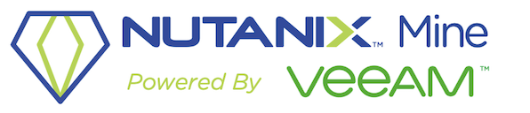

.. _veeam:

---------------------------------------------
Veeam Backup and Replication
---------------------------------------------

*The estimated time to complete this lab is 60 minutes.*

Overview
++++++++

**In this exercise you will connect to a Veeam Backup Server, deploy and configure a Backup Proxy for AHV, configure the connection to your Nutanix cluster and existing Veeam Backup & Replication infrastructure, and execute backup and restore operations.**

A Note About Nutanix Mine
+++++++++++++++++++++++++

While this lab focuses on configuring Veeam and backup jobs within Veeam for AHV clusters, it's worth noting that many of the same components and principals apply to Nutanix Mine with Veeam. Some key points to highlight about Mine with Veeam:

- Nutanix Mine is a dedicated secondary storage backup appliance running on pre-validated NX- hardware (HX and DX Support are coming soon)

  - Small
  - Medium
  - Scale-out with the option to leverage Nutanix Objects
- Standard Foundation is run to image and create an AHV cluster
- "Foundation for Mine" VM image is uploaded and run after AOS and AHV are imaged on a Mine appliance
- The Foundation for Mine VM automates via a web interface similar to Standard Foundation:

  - Nutanix Container Creation
  - Nutanix Volume Group Creation
  - Deployment of the Veeam backup components on the Mine cluster

    - Veeam VBR
    - Veeam Repository VMs with Nutanix Volume Groups attached
    - Veeam Windows Proxies
  - Deployment of a custom Prism Element Dashboard for Nutanix Mine

Because we are using shared clusters here at Nutanix Global Tech Summit, we cannot deploy Nutanix Mine with Veeam to the lab clusters, but for more information, including details, setup instructions, and sales assets, check out `<http://ntnx.tips/mine>`_

Deploying Veeam Backup Server
+++++++++++++++++++++++++++++

.. note:: By default the Veeam Backup Server will deploy a Windows SQL Server Express database instance. A production Veeam deployment would use an external, highly available database.

The Veeam Backup Server is the main management component in the Veeam backup infrastructure. The Veeam Backup Server is responsible for managing Veeam backup repositories that are used as a target for backup. The Veeam Backup & Replication Console is also used for granular VM restore operations such as restoring individual files, AD objects, Exchange mailboxes, and SQL/Oracle databases.

#. In **Prism > VM > Table**, click **+ Create VM**.

#. Fill out the following fields and click **Save**:

   - **Name** - *Initials*\ -VeeamServer
   - **Description** - Veeam Backup & Replication 10
   - **vCPU(s)** - 4
   - **Number of Cores per vCPU** - 1
   - **Memory** - 4 GiB
   - Select :fa:`pencil` beside **CD-ROM**

     - **Operation** - Clone from Image Service
     - **Image** - VBR_10.0.0.4442.iso
     - Select **Update**
   - Select **+ Add New Disk**

     - **Operation** - Clone from Image Service
     - **Image** - Windows2016.qcow2
     - Select **Add**
   - Select **+ Add New Disk**

     - **Operation** - Allocate on Storage Container
     - **Storage Container** - Default
     - **Size (GiB)** - 250
     - Select **Add**
   - Select **Add New NIC**

     - **VLAN Name** - Secondary
     - Select **Add**
   - Select **Custom Script**
   - Select **Type or Paste Script**

   .. literalinclude:: VeeamServer-unattend.xml
      :caption: VeeamServer Unattend.xml Custom Script
      :language: xml

   .. note::

    The Unattend script will disable the Windows Firewall.

#. Select the *Initials*\ **-VeeamServer** VM and click **Power on**.

#. Once the VM has started, connect via RDP or click **Launch Console**.

   .. note::

     It is recommended that the VM be accessed via Microsoft RDP, enabling you to copy and paste text from the lab guide into the VM. The Sysprep process will take approximately 2 minutes before the VM can be accessed via RDP.

     - **Username** - Administrator
     - **Password** - nutanix/4u

#. Open **PowerShell** and execute the following command:

   .. code-block:: Powershell
     :emphasize-lines: 1

     Get-Disk | Where partitionstyle -eq 'raw' | Initialize-Disk -PartitionStyle MBR -PassThru | New-Partition -AssignDriveLetter -UseMaximumSize | Format-Volume -FileSystem NTFS -NewFileSystemLabel "Backups" -Confirm:$false

   .. note:: Windows Explorer may prompt you to format the disk - you can cancel this prompt as the Powershell scriptlet above will format the disk for you

#. On the Veeam Server, right-click the start menu and select **System**. In the **Hostname, domain, and workgroup settings** section, click on "Change settings," then click **Change** to rename the server within Windows to match the VM name *Initials*\ **-VeeamServer**. When prompted, restart the server

   .. figure:: images/0aa.png

#. Open the **Veeam Backup and Replication 10** Setup from the mounted .iso image (you may need to open the Setup.exe executable on the disk). Click **Install**.

   .. figure:: images/0a.png

   The installer may install some pre-requisites and require a reboot. Follow the prompts to install the Veeam Backup and Replication Server.

#. Accept the license agreements and click **Next**.

#. Download the NFR license for the Veeam Backup and Replication Server, located `Here <http://10.42.194.11/images/Veeam/VBRv10RTM/Veeam-100instances-suite-nfr.lic>`_ You can download the file to your local machine then copy and paste the file into the RDP session

#. Click **Browse** and select the downloaded Veeam NFR license file. Click **Next > Next**.

#. If prompted for missing pre-requisite components, click **Install**. After completion, click **Next**.

   .. figure:: images/0b.png

#. Review the configuration and click **Install**.

   .. figure:: images/0c.png

#. While the installation completes, you can create the necessary DNS entry for the Veeam VBR Server. Open a Console to AutoAD, login using Administrator credentials:
     - **Username:** Administrator
     - **Password:** nutanix/4u

#. Open the DNS console by navigating to Start > Windows Administration Tools > DNS. Navigate to DC > Forward Lookup Zones > ntnxlab.local.

#. Create an A record for your xyz-VeeamServer that matches the IP address that was assigned via DHCP. Ensure the "Create associated pointer (PTR) record"

   .. figure:: images/0d.png

#. After the installation completes, we need to install the Veeam Nutanix AHV Plugin on the Veeam Backup and Replication Server. You can download the plugin to the xyz-VeeamServer using this `Link <http://10.42.194.11/images/Veeam/VBRv10RTM/NutanixAHVPlugin_10.0.0.908.exe>`_

#. Launch the installer and follow the prompts to install the Nutanix AHV Plugin on the Veeam Server:

   .. figure:: images/0e.png

By default the Veeam Backup Server will deploy a Windows SQL Server Express database instance. A production Veeam deployment would use an external, highly available database.

The installer will also create a Veeam Backup Repository to act as a backup target, by default it will select the volume with the most free space exposed to the backup server (the local 250GB disk added to the *Initials*\ **-VeeamServer** VM).

For storing backups of Nutanix AHV VMs, Veeam currently supports the use of simple backup repositories (any Windows-compatible file or block storage), scale-out backup repositories, and ExaGrid appliances. With the release of v10, DellEMC Data Domain DD Boost and HPE StoreOnce Catalyst proprietary storage protocols are now supported for Veeam Availability for Nutanix.

Veeam Backup Proxy
++++++++++++++++++++++++++++

The Backup Proxy is a Linux based virtual appliance that performs the role of a coordinator between the Nutanix platform and Veeam Backup & Replication. Veeam introduced support for Nutanix AHV back in 2018 with its Veeam Availability for Nutanix, or VAN, version 1 virtual appliance. This virtual appliance could be deployed to each AHV cluster to be backed up via Veeam. Since its initial release, there have been three major updates, the latest being Update 3 release in November of 2019, which includes a number of performance upgrades and bug fixes.

And while the VAN provided basic backup capabilities for workloads running on AHV, Veeam has added additional enhancements for AHV, aligned with its Backup and Replication version 10 release. The new appliance is named the "Veeam Backup and Replication AHV Backup Proxy" (but is often referred to as VANv2)

New features released with v10 include:

- Veeam Backup and Replication Console Integration

  - AHV Cluster Registration from the VBR Console
  - Central deployment from the Veeam VBR Console
  - Integrated License Management for AHV Backup Proxy

- Backup Features

  - Nutanix snapshot-aware
  - Linux File-level Restore (FLR)
  - Option to Keep or Overwrite Files
  - Instant VM Recovery (note it requires a vSphere host to run the recovered VM)
  - Support for VeeamZip
  - Native Deduplication appliance support

    - DellEMC Data Domain DD Boost
    - HPE StoreOnce Catalyst
  - Multi-user access to the UI
  - Email Job Status Notification
  - Drive Exclusions for VMs
  - Ability to schedule Active Full Backups via the Veeam VBR Console

- Veeam ONE Monitoring and Reporting

  - Backup Job Performance and Statistics
  - Triggered Alarms
  - Enumerated Protected VMs

- Support for Nutanix and Veeam Community Edition

The Backup Proxy communicates with the AHV platform via Nutanix REST API, assigns necessary resources for backup and restore operations, reads/writes data from/to Nutanix storage containers and transports VM data to/from target Veeam backup repositories. The Backup Proxy is also responsible for job management and scheduling, data compression and deduplication, and applying retention policy settings to backup chains.

Each Nutanix cluster leveraging Veeam for backup will require its own Backup Proxy VM.

With the release of the new AHV Backup proxy, we can deploy it automatically from the VBR Console itself rather than having to spin up a VM manually on each cluster we wish to backup. To do so, login to the VBR VM and launch the Veeam VBR Console

Deploying the AHV Backup Proxy
------------------------------

#. From the Nutanix cluster, navigate to Settings > Local User Management and select + New User. Create a local user named "xyzveeam," where xyz are your initials:

   - User: xyzveeam
   - Password: nutanix/4u
   - First Name: [Your First Name]
   - Last Name: [Your last name]
   - E-mail: xyz-veeam@ntnxlab.local

#. Grant the user *Cluster Admin* privileges then click Save

   .. figure:: images/0.png

#. Use Remote Desktop or the VM console to connect to your Veeam VBR VM you deployed earlier and launch the Veeam Backup and Replication console

#. Navigate to "Backup Infrastructure"

#. Under Managed Servers, right-click on "Managed Servers" and select "Add Server"

   .. figure:: images/2.png

#. Click on "Nutanix AHV"

#. Enter the IP address of your cluster, then click Next>

   .. figure:: images/3.png

#. For credentials, click "Add..."

#. Enter the credentials you had specified earlier on the Nutanix Cluster (xyzveeam / nutanix/4u). Click OK, then Next >

   .. figure:: images/5.png

   .. note:: You will be prompted by a Security Warning when the Veeam Server connects to Prism. Click **Continue**

#. Select the Default Storage Container and change the Network to "Secondary" by using the "Choose" button to the right. There's no need to specify a static IP address on this pane, so click Next >

   .. figure:: images/6.png

#. The VBR will add the Nutanix Cluster as a managed server. When complete, click Next >

   .. figure:: images/7.png

#. Click Finish. We now need to deploy a Backup Proxy for AHV to the cluster. The VBR will automatically prompt you to do so. Choose **No** from the prompt

   .. figure:: images/8.png

   .. note:: With VBR v10, Veeam supports the ability to deploy the Backup Proxy for AHV from the VBR console, however with this pre-production release here at Tech Summit the deployment fails, so we will manually deploy the Veeam Nutanix AHV Backup Proxy Manually and import it into the VBR

#. From Prism, click **+ Create VM** to create a new VM.

#. Fill out the following fields and click **Save**:

   - **Name** - *Initials*\ -VeeamAHVProxy
   - **vCPU(s)** - 4
   - **Number of Cores per vCPU** - 1
   - **Memory** - 4 GiB
   - Select **+ Add New Disk**

     - **Operation** - Clone from Image Service
     - **Image** - VeeamAHVProxy2.0.404
     - Select **Add**
   - Select **Add New NIC**

     - **VLAN Name** - Secondary
     - Select **Add**

#. Power on the VM. The VM will boot. After boot completes, note the IP address the Veeam Backup Proxy was assigned from DHCP.

   .. figure:: images/9.png

#. As done for the Veeam VBR Server, navigate to the AutoDC VM, launch the DNS console, navigate to DC > Forward Lookup Zones > ntnxlab.local.

#. Create an A record using the IP address that was assigned to the Veeam Backup Proxy:

   .. figure:: images/1.png

#. Once the VM has started, open \https://<*VeeamProxy-VM-IP*>:8100/ in a browser. Log in using the default credentials:

   - **Username** - veeam
   - **Password** - veeam

   .. figure:: images/16.png

#. After authenticating, choose the option to Install

   .. figure:: images/installproxy1.png

#. Accept the EULA and click Next

#. Specify new credentials for the user **veeam**:

   - **Login:** veeam
   - **Old password:** veeam
   - **New password:** nutanix/4u
   - **Confirm new password:** nutanix/4u

   .. figure:: images/installproxy2.png

#. Enter the Proxy name you had specified earlier when creating the VM. Leave the default network options selected

   .. figure:: images/installproxy3.png

#. Review the summary and click Finish. The AHV Proxy appliance will apply settings and reload.

#. Return to the Veeam Backup and Replication Console within the Veeam Server Windows session. Click on Backup Infrastructure, right-click on **Backup Proxies** and select **Add Nutanix backup proxy...**

   .. figure:: images/10.png

#. Select **Connect proxy**

   .. figure:: images/10a.png

#. Select the following options in the prompt:

   - **Cluster:** <your cluster>
   - **Name:** *Initials*\ -VeeamAHVProxy

   Click **Next >**

#. Leave default network options, then click **Next >**

#. Click **Add..** to add the Backup Proxy credentials:

   - **Username:** veeam
   - **Password:** nutanix/4u

   Click **Next >**

#. Leave the default Access Permissions

   .. figure:: images/12.png

   .. note:: You will be prompted by a Security Warning when the Veeam Server connects to Prism. Click **Continue**

#. The VBR will add the AHV Backup Proxy we deployed. Click **Next >**

   .. figure:: images/13.png

#. Clic **Finish** on the Summary screen

Backing Up A VM
+++++++++++++++

Veeam Backup & Replication backs up Nutanix AHV VMs at the image level, just like VMware vSphere and Microsoft Hyper-V VMs. The Backup Proxy communicates with Nutanix AHV to trigger a VM snapshot, retrieves VM data block by block from Storage Containers hosting VMs, compresses and deduplicates the data, and writes to the Backup Repository in Veeam’s proprietary format.

For AHV VMs, the Veeam Backup & Replication backup proxy copies the whole content of the VM and creates a full backup file (VBK) in the target location. The full backup file acts as a starting point of the backup chain, where format subsequent backup sessions, Veeam copies only those data blocks that have changed since the previous backup, and stores these data blocks to an incremental backup file in the target location. Incremental backup files depend on the full backup file and preceding incremental backup files in the backup chain. The Backup Proxy integrates with Nutanix's Change Block Tracking (CBT) API to determine the changed portion of a VM's data to enable efficient, incremental backups. With the new version of the AHV backup proxy, administrator can now schedule both full or incremental backups (whereas in the previous version, after the first full backup was taken, all subsequent backups were incrementals)

#. In **Prism > VM > Table**, click **+ Create VM**.

#. Fill out the following fields and click **Save**:

   - **Name** - *Initials*\ -VeeamBackupTest
   - **vCPU(s)** - 2
   - **Number of Cores per vCPU** - 1
   - **Memory** - 4 GiB
   - Select **+ Add New Disk**

     - **Operation** - Clone from Image Service
     - **Image** - Windows2012
     - Select **Add**
   - Select **Add New NIC**

     - **VLAN Name** - Secondary
     - Select **Add**

#. Select the *Initials*\ **-VeeamBackupTest** VM and click **Power on**.

#. Once the VM has started, click **Launch Console**. Complete the Sysprep process and provide a password for the local Administrator account.

#. Log in as the local Administrator and create multiple files on the desktop (e.g. documents, images, etc.).

   .. figure:: images/17.png

#. Login to the Veeam Backup Proxy web console (https://<ip_address>:8100). From the **Veeam Backup Proxy Web Console**, select **Jobs** from the toolbar.

   .. figure:: images/18.png

#. Click **+ Add**, provide a name for the backup job (e.g. *Initials*\ -DevVMs), leave the default option of "Backup job" and click **Next**.

   .. figure:: images/19.png

#. Click **+ Add** and search for the VM you created for this exercise. Click **Add > Next**.

   .. figure:: images/20.png

.. note::

  Dynamic Mode allows you to backup all VMs within a Nutanix Protection Domain. This could make configuration of a backup job simpler if you are already taking advantage of Nutanix PDs, it will also ensure any new VMs added to the PD are backed up by Veeam without having to modify the job.

Select **Default Backup Repository** and click **Next**. This is the 250GB disk attached to the *Initials*\ **-VeeamServer** VM, but other supported Veeam backup repositories could be selected if available in the environment.

Fill out the following fields and click **Next**:

- Select **Run this job automatically**
- Select **Periodically every:**
- Select **1**
- Select **Hour**
- **Restore Points to keep on disk** - 5

Select **Run backup job when I click Finish** and click **Finish**.

Monitor the progress of until the initial full backup completes successfully. The initial backup should take approximately 2-5 minutes. Click **Close**.

.. note::

  You can click **Close** without interrupting the backup job. To view job progress again click the **Running** link under **Status** of the backup job.

Return to your *Initials*\ **-VeeamBackupTest** VM console and make some small changes (e.g. downloading wallpaper images from the Internet, installing an application, etc.)

From the **Veeam Backup Proxy Web Console > Backup Jobs**, select your job and click **Start** to manually trigger an incremental backup to add to the backup chain.

The second backup job should complete in under 1 minute as there should be minimal delta between the original full backup and the new incremental backup. Note that the full capacity of the VM's disk was processed (40GB), but due to the Change Block Tracking API, only a small amount of data was actually read and transferred to the backup repository. This was also accomplished without having to "stun" the VM to perform a hypervisor level snapshot.

.. note::

  Administrators also have the ability to manually trigger a new, full backup of VMs by selecting a job and clicking **Active Full**. This new full backup would reset the backup chain, and all subsequent incremental backups would use it as a starting point. The previous full backup will remain in the repository until it is removed from the backup chain based on configured retention.

Return to the **Dashboard** for a high level overview of the most critical backup metrics for the cluster. While Veeam Backup & Recovery offers a solution for managing backups across a large environment, the AHV Backup Proxy provides a streamlined, HTML5 UI for Nutanix administrators to control their backups and identify key issues that could impact data protection.

Restoring A VM
++++++++++++++

Using the Backup Proxy Web Console, you can restore a VM from backup to the Nutanix AHV cluster. With Veeam Backup & Replication v10, it now supports restoring from one Nutanix cluster to another. During the restore process, the Backup Proxy retrieves VM disk data from the backup on the Veeam Backup Repository, copies it to the Storage Container where disks of the original VM were located, and registers a restored VM on the Nutanix AHV cluster.

From the **Veeam Back Proxy Web Console**, select **Protected VMs** from the toolbar.

Select your test backup VM *Initials*\ **-VeeamBackupTest** and click **Restore**.

Using the **Add**, **Remove**, and **Point** options, you can selectively restore the desired VM(s) to a specific time. By default, the VM will be restored based on the most recent backup.

Click **Next**.

Select **Restore to a new location** and click **Next** to clone the VM from backup data rather than overwriting the existing VM.

Select *Initials*\ **-VeeamBackupTest** and click **Name VM**. Select **Add suffix**. **Untick** the option "Preserve virtual machine ID" and click **OK > Next**:

If desired, you can expand the VM and redirect the restored VM to an alternate Nutanix storage container. By default, the VM will be restored to its original storage container.

Click **Next**.

If desired, you can expand the network and assign the restored VM to an alternative network on the cluster. For this exercise, leave the default network selected (it should be Secondary). Click **Next**.

Specify a reason for the restore operation and click **Next**.

Click **Finish** and monitor the restore operation until successfully completed.

.. note::

  If the most recent restore point is selected, the restore operation will complete very rapidly. Veeam will retain the most recent, rolling snapshot of each VM and can restore directly from the local snapshot rather than the backup target storage.

Power on the restored VM in Prism and verify it reflects the latest manual backup.

**Congratulations!** From a single web console you were able to manage and monitor your Veeam backup operations for your Nutanix cluster.

In addition to full VM restores, the **Veeam Backup Proxy Web Console** can also restore individual virtual disks which can be mapped to any VM within the cluster. This functionality can be helpful if virtual disks containing data become corrupted (e.g. cryptolocker, virus, etc.).

Try restoring your backup test VM disk directly to your Windows Tools VM!

File Level Restore and More
+++++++++++++++++++++++++++

While the **Veeam Backup Proxy Web Console** delivers all of the basic data protection functionality required by an infrastructure administrator, additional advanced functionality can be accessed on the **Veeam Backup Server** using the **Veeam Backup & Replication Console**.

A common use case for restoring data is accessing individual files within a guest that have been inadvertently changed or deleted. Eliminating the need to provision an entire VM to access a single file can significantly decrease the time and resources required.

From the *Initials*\ **-VeeamServer** console (or RDP session), open **Veeam Backup & Replication Console**.

From the **Home** tab, expand **Backups**, then click **Disk**. Right-click on the guest VM disk (xyz-VeeamBackupTest) you want to restore an individual file from and select **Restore guest files** > **Microsoft Windows**

Select the backup from which you want to restore a file then click **Next**. Optionally provide a Restore reason then click **Next**

Review the File Level Restore Summary then click **Finish**

Veeam will virtually mount the VM disks associated with the backup and display them in the **Backup Browser** app.

.. note::

  You can also explore the file level restore mount locally on the *Initials*\ **-VeeamServer** under ``C:\VeeamFLR``.

Navigate to and select a file you wish to restore. Clicking Right-click and select **Restore**. Note the option to **Overwrite** or **Keep** as well as the option to **Copy To** another location

Close the **Backup Browser** to unmount the backup.

The **Backup Browser** can also be used in conjunction with the **Veeam Explorer** applications to perform application aware restores for Microsoft Active Directory, Exchange, SharePoint, SQL Server, and Oracle workloads.

.. _veeam-objects:
(Optional) Configuring Nutanix Objects as a Target
++++++++++++++++++++++++++++++++++++++++++++++++++

Veeam supports the ability to backup workloads to S3-compatible object store. This is a prime use case for Nutanix Objects and one way in which we accommodate large backup workloads with Nutanix Mine - we size an initial Mine Secondary Storage cluster, and a separate Nutanix Objects cluster which can be configured as a target within Veeam.  Configuring Objects within Veeam is simple and straightforward and there's little to no performance penalty for using on-prem objects relative to using a traditional iSCSI backup target

.. note:: To save time, we have already enabled Objects within Prism Central and pre-staged an object store named "ntnx-objects." We will create our Bucket within that object store

Create Access Keys
-------------------

#. Navigate to Prism Central > Services > Objects

#. Click on "Access Keys" in the top left menu

#. Click on "+ Add People," then select "Add people not in a directory service," then specify the name "xyzveeam@ntnxlab.local." Click Next

   .. note:: You can configure a directory service for user authentication here rather than local users

   .. figure:: images/32.png

#. Click Download Keys to download the user authentication key to your local machine. Then click Close.  We will use these keys later when we configure a bucket within Veeam

   .. figure:: images/33.png

Configuring a Bucket
---------------------

Since Object Storage uses API keys to grant access to various buckets, we'll want to create a bucket using the API key we just created above.
A bucket is a sub-repository within an object store which can have policies applied to it, such as versioning, WORM, etc. By default a newly created bucket is a private resource to the creator. The creator of the bucket by default has read/write permissions, and can grant permissions to other users.

#. Click on your Object Store then click **Create Bucket**

   .. figure:: images/buckets-1.png

#. Name the bucket *INITIALS*-**veeam-bucket** > click **Create**

   .. note::

      Bucket names must be lower case and only contain letters, numbers, periods and hyphens.
      Additionally, all bucket names must be unique within a given Object Store. Note that if you try to create a folder with an existing bucket name (e.g. *your-name*-my-bucket), creation of the folder will not succeed.
      Creating a bucket in this fashion allows for self-service for entitled users, and is no different than a bucket created via the Prism Buckets UI.

   .. figure:: images/buckets-2.png

#. Click on the bucket you just created, then click **Edit User Access**

   .. figure:: images/buckets-3.png

   .. figure:: images/buckets-4.png

#. Find your user and give it **Read and Write** access

   .. figure:: images/buckets-5.png

Configure Nutanix Objects within Veeam
---------------------------------------

#. Within the Veeam VBR console click on **Backup Infrastructure** > **Backup Repositories**.

   .. figure:: images/36.png

#. Right-click on Backup Repositories and choose **Add Backup Repository** and select "Object storage"

   .. figure:: images/37.png

#. Choose "S3 Compatible". Whem prompted, specify a Name for the new Object Storage Repository that matches the bucket you created earlier - *Initials*veeam-bucket, then click **Next>**

#. For the Account section, specify the information as noted below:

   - Service Point: https://<IP of Object Store Client IP>
   - Region: <leave default>
   - Credentials: Click **Add** > Enter Access key and Secret key, which are in the file previously downloaded when creating the Bucket in Nutanix Objects

   .. note:: You can locate the Service Point address from Objects by connecting to Prism Central navigating to **Services** > **Objects**. Within the table, you will find the "Client Used IPs" which is the Service Endpoint

      .. figure:: images/38.png

   .. figure:: images/39.png

   Click Next> and accept any Certificate Security Alerts

#. You should be able to see the bucket you created in the last section.  Click "Browse" for Folder and create a new folder named "backup"

   .. figure:: images/40.png

#. Click Finish

You can now configure backup jobs to leverage Nutanix Objects as an archival tier.

Once VM backups are stored in the Veeam Backup Repository, Veeam offers backup copy functionality to create multiple instances of the same backup data in different locations.

Like primary backups configured through the AHV Backup Proxy, backup copy is a job-driven process. Veeam Backup & Replication fully automates the backup copy process and lets you specify retention settings to maintain the desired number of restore points, as well as full backups for archival purposes.

Backup copy makes it simple to follow the "3-2-1" rule recommended by backup experts:

- **3** - You must have at least three copies of your data: the original production data and two backups.

- **2** - You must use at least two different types of media to store the copies of your data (e.g. local disk and tape/cloud).

- **1** - You must keep at least one backup offsite (in the cloud or in a remote site).

Takeaways
+++++++++

What are the key things you should know about **Veeam** and the **Backup Proxy for AHV**?

- Veeam is a widely adopted backup technology that features native support for Nutanix AHV.

- The Veeam Backup Proxy for AHV provides a standalone HTML5 UI for Nutanix administrators to quickly perform backup and restore operations without access to the Veeam Backup & Replication Console.

- Veeam provides agentless VM backup, integrating directly with Nutanix snapshots via API.

- Veeam has advanced restore capabilities including support for file level restore, Microsoft Active Directory, Microsoft Exchange, Microsoft SQL Server, and Oracle.
