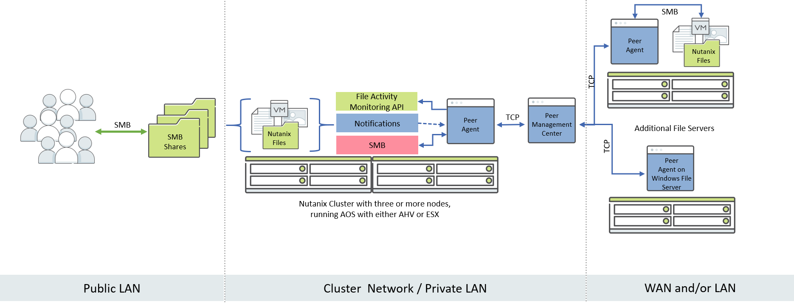
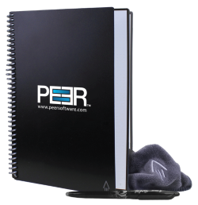
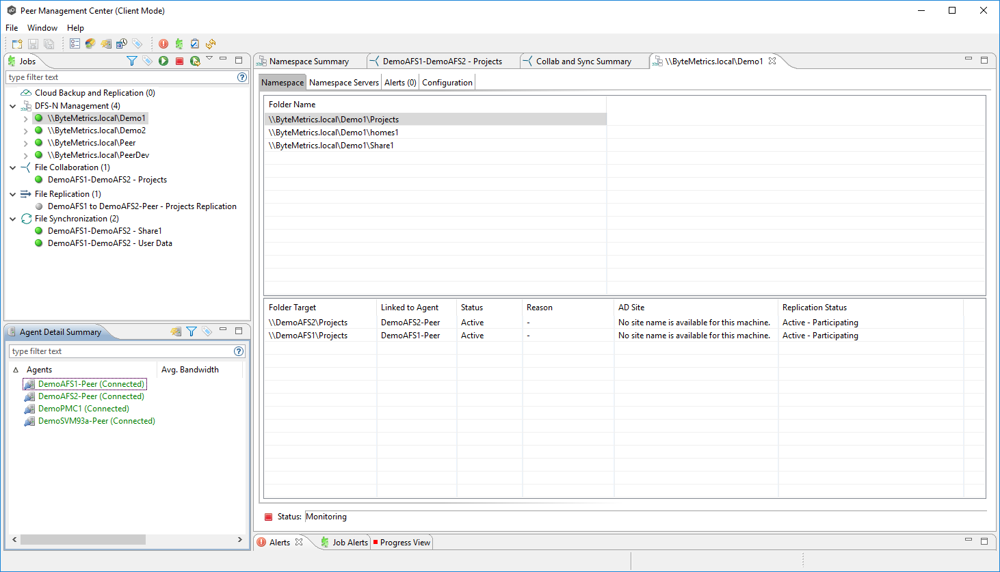

.. role:: html(raw)
   :format: html

.. _peer:

------------------------
Peer Global File Service
------------------------

*The estimated time to complete this lab is 60 minutes.*

**Google Chrome, Apple Safari, or Microsoft Edge is recommended for this lab.**

Overview
++++++++

The explosive growth of unstructured data has driven organizations to seek solutions to efficiently store, share, manage, and protect an ever-growing universe of data while deriving new value and intelligence. Since 1993, Peer Software has focused on these requirements and more by building best-of-breed data management and real-time replication solutions for distributed on-premises and cloud storage environments.

Peer’s flagship offering, Peer Global File Service (PeerGFS), features enterprise-class replication technology with integrated file locking and a globally accessible namespace that powers multi-site, multi-vendor, and multi-cloud deployment.

PeerGFS enables fast local data access for users and applications at different locations, protects against version conflicts, makes data highly available, and allows Nutanix Files to co-exist with legacy NAS platforms to ease adoption of Files into existing environments.

Key use cases for combining Peer Software with Nutanix include:

- **Global File Sharing and Collaboration** - Deliver fast local access to shared project files for distributed teams while ensuring version integrity and high availability.
- **HA and Load Balancing for User and Application Data** - Enable high availability and load balancing of end user data as well as application data.
- **Storage Interoperability** - Cross-platform support powers coexistence of Nutanix Files with existing NAS and hybrid cloud storage systems, as well as between file and object formats.
- **Analysis and Migration** - Analyze existing storage for resource planning, optimization, and migrations. Analysis combined with real-time replication powers minimally disruptive data migrations.

*How does it work?*

Working from left to right, users interact with the SMB shares on the Nutanix Files cluster via a public LAN. When SMB activity occurs on the Files cluster through these shares, the Peer Partner Server (referred to as a Peer Agent) is notified via the File Activity Monitoring API from Files. The Peer Agent accesses the updated content via SMB, and then facilitates the flow of data to one or many remote and/or local file servers.

**In this lab you will configure Peer Global File Service to create an Active-Active file services solution with Nutanix Files, replicate content from Nutanix Files to Nutanix Objects, and use our File System Analyzer tool to analyze some sample data.**

When you are done with these three sections, get your lab validated by a member of the Peer Software team. We have a Rocketbook reusable notepad with pen and refresh cloth for you!

Lab Setup
+++++++++

   .. note::

    This lab requires the :ref:`windows_tools_vm`.

Files
.....

This lab requires an existing Nutanix Files deployment on your assigned cluster. Details on how to configure Nutanix Files for use with Peer Global File Service can be found in the `Configuring Nutanix Files`_ section below.

Peer VMs
........

In this exercise, you will be using three shared VMs, all of which should already be available on your assigned cluster.

.. list-table::
   :widths: 20 40
   :header-rows: 1

   * - **VM Name**
     - **Description**
   * - **PeerMgmt**
     - This server is running the Peer Management Center.
   * - **PeerAgent-Files**
     - This server will manage the Nutanix Files cluster.
   * - **PeerAgent-Win**
     - This Windows File Server will be used as a target for replication.

Configuring Nutanix Files
............

Peer Global File Service requires both a File Server Admin account as well as REST API access to orchestrate replication to or from Nutanix Files.

#. Log in to **Prism Element** (e.g. 10.XX.YY.37) on your Nutanix cluster.

#. Navigate to **File Server** from the drop down navigation and select the **BootcampFS** deployment.

#. Click **+ Share/Export** and fill out the following fields:

   - **Name** - *Initials*\ **-Peer**
   - **Description (Optional)** - Leave blank.
   - **File Server** - **BootcampFS**
   - **Share Path (Optional)** - Leave blank.
   - **Max Size (Optional)** - Leave blank.
   - **Select Protocol** - SMB

   .. figure:: images/5.png

#. Click **Next**, **Next**, and then **Create**.

#. Click **Manage roles**.

   .. figure:: images/6.png

#. Under **Add admins**, **NTNXLAB\\Administrator** should already be added as a **File Server Admin**. If not, click **+ New user** and add **NTNXLAB\\Administrator**.

   .. figure:: images/7.png

   .. note::

     In a production environment, you would likely use an Active Directory service account for Peer.

#. Under **REST API access users**, check to see if a **peer** account has already been created. If not, click **+ Add new user**, fill out the following fields, and click **Save**:

   - **Username** - peer

     *The username must be in all lower case.*

   - **Password** - nutanix/4u

   .. figure:: images/8.png

   .. note::

     All participants on a single Nutanix AOS cluster will be sharing the same **BootcampFS** file server, as well as the **peer** API account.

#. Click **Close**.

Staging Test Data on PeerAgent-Win
...................

The final step of staging the lab is creating some sample data on PeerAgent-Win, which will be acting as a Windows File Server. Peer is capable of replicating between multiple Files clusters, as well as between a mix of Files and other NAS platforms. For this lab, you will be replicating between your Nutanix Files cluster and a Windows File Server.

#. Connect to your *Initials*\ **-Windows-ToolsVM** via RDP using the following credentials:

   - **Username** - NTNXLAB\\Administrator
   - **Password** - nutanix/4u

#. Open **File Explorer** and navigate to   ``\\PeerAgent-Win\Data``.

#. Create a copy of the **Sample Data** folder. Rename the copy to *Initials*\ **-Data** as shown below.

   .. figure:: images/2.png

Connecting to the Peer Management Center Web Interface
...................

The Peer Management Center (PMC) serves as the centralized management component for Peer Global File Service. It does not store any file data but does facilitate communication between locations, so it should be deployed at a location with the best connectivity. A single deployment of PMC can manage 100 or more Agents/file servers.

For this lab, you will be accessing a shared PMC deployment via a web interface.

#. Open a non-Firefox browser (Chrome, Edge, and Safari will all work) on your *Initials*\ **-Windows-ToolsVM** VM or on your laptop.

#. If you are using a browser on your *Initials*\ **-Windows-ToolsVM** VM, browse to https://PeerMgmt:8443/hub

#. If you are using a browser on your laptop, log in to **Prism Element** (e.g. 10.XX.YY.37) on your Nutanix cluster to find the IP of the PeerMgmt VM, then browse to https://IP-of-PeerMgmt-Server:8443/hub

#. When prompted to login, use the following credentials:

   - **Username** - admin
   - **Password** - nutanix/4u

#. Once connected, confirm that **PeerAgent-Files** and **PeerAgent-Win** both appear in green in the **Agents** view in the bottom left of the PMC web interface.

   .. figure:: images/pmc.png

Introduction to Peer Global File Service
++++++++++++++++++

Peer Global File Service utilizes a job-based configuration engine. Several different job types are available to help tackle different file management challenges. A job represents a combination of:

- Peer Agents.
- The file servers that are being monitored by those Agents.
- A specific share/volume/folder of data on each file server.
- Various settings tied to replication, synchronization and/or locking.

When creating a new job, you will be prompted by a dialog outlining the different job types and why you would use each type.

Available job types include:

- **Cloud Backup and Replication** - Real-time replication from enterprise NAS devices to public and private object storage with support for volume-wide point-in-time recovery. Each file is stored as a single, transparent object with optional version tracking.
- **DFS-N Management** - Manages new and existing Microsoft DFS Namespaces. Can be combined with File Collaboration and/or File Synchronization jobs to automate DFS failover and failback.
- **File Collaboration** - Real-time synchronization combined with distributed file locking to power global collaboration and project sharing across enterprise NAS platforms, locations, cloud infrastructures, and organizations.
- **File Replication** - One-way real-time replication from enterprise NAS platforms to any SMB destination.
- **File Synchronization** - Multi-directional real-time synchronization powering high availability of user and application data across enterprise NAS platforms, locations, cloud infrastructures, and organizations.

Creating a New File Collaboration Job
++++++++++++++++++

In this section, we will focus on **File Collaboration**.

#. In the **PMC Web Interface**, click **File > New Job**.

#. Select **File Collaboration** and click **Create**.

   .. figure:: images/17.png

#. Enter *Initials*\  - **Collab** as the name for the job and click **OK**.

   .. figure:: images/18.png

Files and PeerAgent-Files
....................

#. Click **Add** to begin pairing a Peer Agent with your Nutanix Files cluster.

   .. figure:: images/19.png

#. Select **Nutanix Files** and click **Next**.

   .. figure:: images/20.png

#. Select the Agent named **PeerAgent-Files** and click **Next**. This Agent will manage the Files cluster.

   .. figure:: images/21.png

#. On the **Storage Information** page, you are prompted to enter credentials for accessing the storage device. If another participant sharing your Files cluster has already done the Peer lab, you can select **Existing Credentials** as shown here.

   .. figure:: images/22a.png

   If you are the first participant on this cluster to do the Peer lab, **New Credentials** will be automatically selected. Fill out the following fields:

   - **Nutanix Files Cluster Name** - BootcampFS

     *The NETBIOS name of the Files cluster that will be paired with the Agent selected in the previous step.*

   - **Username** - peer

     *This is the Files API account username configured earlier in the lab and must be in all lower case.*

   - **Password** - nutanix/4u

     *The password associated with the Files API account.*

   - **Peer Agent IP** - **PeerAgent-Files** IP Address

     *The IP address of the Agent server that will receive real-time notifications from the File Activity Monitoring API built into Files. It is selectable from a drop-down list of available IPs on this Agent server.*

#. Click **Validate** to confirm Files can be accessed via API using the provided credentials.

   .. figure:: images/22.png

   .. note::

     Once you enter these credentials, they are reusable when creating new jobs that use this particular Agent. When you create your next job, select **Existing Credentials** on this page to display a list of previously configured credentials.

#. Click **Next**.

#. Click **Browse** to select the share you wish to replicate. You can also navigate to a subfolder below a share.

#. Select your *Initials*\ **-Peer** share and click **OK**.

   .. figure:: images/23.png

   .. note::

     Peer Global File Service supports the replication of data within nested shares starting with Nutanix Files v3.5.1 and above.

   .. note::

     You can only select a single share or folder. You will need to create an additional job for each additional share you wish to replicate.

#. Click **Finish**. You have now completed pairing **PeerAgent-Files** to Nutanix Files.

   .. figure:: images/24.png

PeerAgent-Win
..........

To simplify this lab exercise, a second Peer Agent server running on the same cluster will function as a standard Windows File Server. While Peer can be used to replicate shares between Nutanix Files clusters, one of its key advantages is the ability to work with a mix of NAS platforms. This can help drive adoption of Nutanix Files when only a single site has been refreshed with Nutanix Files, but replication is still required to support collaboration or disaster recovery.

#. Repeat Steps 1-8 in `Files and PeerAgent-Files`_ to add **PeerAgent-Win** to the job, :html:`<strong>making the following changes</strong>`:

   - **Storage Platform** - Windows File Server
   - **Management Agent** - PeerAgent-Win
   - **Path** - C:\\Data\\*Initials*\ **-Data**

   .. figure:: images/25.png

#. Click **Next**.

Completing Collaboration Job Configuration
............................

Peer offers robust functionality for handling the synchronization of NTFS permissions between shares:

- **Enable synchronizing NTFS security descriptors in real-time**

  *Select this checkbox if you want changes to file and folder permissions to be replicated to the remote file servers as they occur.*

- **Enable synchronizing NTFS security descriptors with master host during initial scan**

  *Select this if you want the initial scan to look for and replicate any permissions that are not in sync across file servers.  This requires selecting a master host to help resolve situations where the engine cannot pick a winner in a permission discrepancy.*

- **Synchronize Security Description Options**

  *(Optional) Select the NTFS permission types you would like to replicate.*

  - **Owner**

    *The NTFS Creator-Owner who owns the object (which is, by default, whoever created it).*

  - **DACL**

    *A Discretionary Access Control List identifies the users and groups that are assigned or denied access permissions on a file or folder.*

  - **SACL**

    *A System Access Control List enables administrators to log attempts to access a secured file or folder. It is used for auditing.*

- **File Metadata Conflict Resolution**

  *If there is a permission discrepancy between two or more sites, the permissions set on the file server tied to the master host will override those on the other file servers.*

#. For the purposes of this lab exercise, accept the default configuration and click **Next**.

   .. figure:: images/26.png

#. Under **Application Support**, select **Microsoft Office**.

   The Peer synchronization and locking engine is automatically optimized to best support any of the selected applications.

   .. figure:: images/27.png

#. Click **Finish** to complete the job setup.

Starting a Collaboration Job
++++++++++++++

Once a job has been created, it must be started to initiate synchronization and file locking.

#. In the **PMC Web Interface**, under **Jobs**, right-click on your newly created job, and then select **Start**.

   .. figure:: images/28.png

   When the job starts:

   - Connectivity to all Agents and Files clusters (or other NAS devices) is checked.
   - The real-time monitoring engine is initialized.
   - A background scan is kicked off to ensure all file servers are in sync with another.

#. Double-click the job in the **Job** pane to view its runtime information and statistics.

   .. note::

     Click **Auto-Update** to have the console regularly refresh as files begin replicating.

   .. figure:: images/29.png

Testing Collaboration
+++++++++++++++++

The easiest way to verify synchronization is functioning properly is to open separate File Explorer windows for the Nutanix Files and Windows File Server paths.

.. note::

  Do **not** test using an Agent server VM. All activity from these servers are automatically filtered to reduce overhead on the Nutanix Files cluster.

#. Connect to your *Initials*\ **-Windows-ToolsVM** via RDP using the following credentials:

   - **Username** - NTNXLAB\\Administrator
   - **Password** - nutanix/4u

#. Open File Explorer and browse to your Nutanix Files share, e.g., ``\\BootcampFS\Initials-Peer``. Drag this window to the left side of the desktop.

   Note that the sample data seeded in the Windows File Server during lab setup has already been replicated to Nutanix Files.

   .. note::

     You can also verify the replicated files in **Prism > File Server**.

#. Open a second File Explorer window and browse to your Windows File Server share, e.g., ``\\PeerAgent-Win\Data\Initials-Data``. Drag this window to the right side of the desktop.

   .. figure:: images/30.png

#. In the File Explorer on the left, create a copy of one of the sample data directories by copying and pasting within the root of the share (shown below).

   .. figure:: images/31.png

   .. figure:: images/32.png

#. The changes that are performed on the Nutanix Files share will be sent to its paired Agent; the Agent will then facilitate the replication of these files and folders to the other server (and vice versa).

   .. figure:: images/33.png

#. To test file locking, create a new OpenDocument Text file within the root of your Nutanix Files share, e.g., ``\\BootcampFS\Initials-Peer``.

   .. figure:: images/34.png

#. Name the file. Within a few seconds, it should appear under your Windows File Server share, e.g., ``\\PeerAgent-Win\Data\Initials-Data``.

   .. figure:: images/35.png

#. Open the file under the Nutanix Files share with OpenOffice Writer. Next, open the file with the same name under ``\\PeerAgent-Win\Data\Initials-Data``. You should see the following warning that the file is locked.

   .. figure:: images/36.png

   **Congratulations!** You have successfully deployed an Active-Active file share replicated across two file servers. Using Peer, this same approach can be leveraged to support file collaboration across sites, migrations from legacy solutions to Nutanix Files, or disaster recovery for use cases such as VDI, where user data and profiles need to be accessible from multiple sites for business continuity.

Working with Nutanix Objects
++++++++++++++

Peer Global File Service includes the ability to push data from NAS devices into object storage. The same real-time replication technology used to power the collaboration scenario above can also be used to replicate data into Nutanix Objects with optional snapshot capabilities for point-in-time recovery. All objects are replicated in a transparent format that can be immediately used by other apps and services.

This lab section will walk you through the necessary steps to replicate data from Nutanix Files into Nutanix Objects.

Getting Client IP and Credentials for Nutanix Objects
............

In order to replicate data into Objects, you need the Client IP of the object store and need to generate access and secret keys. If you already have this information from a prior lab, you can skip this section and re-use that existing information.

#. Log in to **Prism Central** (e.g., 10.XX.YY.39) on your Nutanix cluster, and then navigate to **Services** > **Objects**.

#. In the **Object Stores** section, find the appropriate object store in the table and note the Client Used IPs.

   .. figure:: images/clientip.png

#. Click on the **Access Keys** section and click **Add People** to begin the process for creating credentials.

   .. figure:: images/buckets_add_people.png

#. Select **Add people not in Active Directory** and enter your e-mail address.

   .. figure:: images/buckets_add_people2.png

#. Click **Next**.

#. Click **Download Keys** to download a .csv file containing the **Access Key** and **Secret Key**.

   .. figure:: images/buckets_add_people3.png

#. Click **Close**.

#. Open the file with a text editor.

   .. figure:: images/buckets_csv_file.png

   .. note::

     Keep the text file open so that you have the access and secret keys readily available for the sections below.

Creating a New Cloud Replication Job
............

In this section, we will focus on creating a **Cloud Backup and Replication** job to replicate data from Nutanix Files into Nutanix Objects.

#. In the **PMC Web Interface**, click **File > New Job**.

   .. figure:: images/cloud1.png

#. Select **Cloud Backup and Replication** and click **Create**.

#. Enter *Initials*\  - **Replication to Objects** as the name for the job and click **OK**.

   .. figure:: images/cloud2.png

#. Select **Nutanix Files** and click **Next**.

   .. figure:: images/cloud3.png

#. Select the Agent named **PeerAgent-Files** and click **Next**. This Agent will manage the Files cluster.

   .. figure:: images/cloud4.png

#. On the **Storage Information** page, you will see one of two pages. If another participant sharing your Files cluster has already done the Peer lab, you can select their **Existing Credentials** as shown here.

   .. figure:: images/cloud5.png

   If you are the first participant on this cluster to do the Peer lab, fill out the following fields:

   - **Nutanix Files Cluster Name** - **BootcampFS**

     *The NETBIOS name of the Files cluster that will be paired with the Agent selected in the previous step.*

   - **Username** - peer

     *This is the Files API account username configured earlier in the lab and MUST be in all lower case.*

   - **Password** - nutanix/4u

     *The password associated with the Files API account.*

   - **Peer Agent IP** - **PeerAgent-Files** IP Address

     *The IP address of the Agent server that will receive real-time notifications from the File Activity Monitoring API built into Files. It will be selectable from a dropdown list of available IPs on this Agent server.*

#. Click **Validate** to confirm Files can be accessed via API using the provided credentials.

   .. figure:: images/cloud6.png

   .. note::

     Once you enter these credentials, they are reusable when creating new jobs that use this particular Agent. When you create your next job, select **Existing Credentials** on this page to display a list of previously configured credentials.

#. Click **Next**.

#. Select your *Initials*\ **-Peer** share and click **OK**.

   .. figure:: images/cloud7.png

   .. note::

     Peer Global File Service supports the replication of data within nested shares starting with Nutanix Files v3.5.1 and above.

   .. note::

     With **Cloud Backup and Replication**, you can select multiple shares and/or folders for a single job.

#. On the **File Filters** page, verify the **Default** filter selected as well as the **Include Files Without Extensions**, and click **Next**.

   .. figure:: images/cloud8.png

#. On the **Destination** page, select **Nutanix Objects** and click **Next**.

   .. figure:: images/cloud9.png

#. On the **Nutanix Objects Credentials** page, fill out the following fields:

   - **Description** – Name your destination

     *This is a short name for the Objects credential configuration.*

   - **Access Key**

     *The Access Key associated with the Objects account.*

   - **Secret Key**

     *The Secret Key associated with the Objects account.*

   - **Service Point**

     *The client access IP address or FDQN name of the object store.*

   .. figure:: images/cloud10.png

      .. note::

     Refer to the `Getting Client IP and Credentials for Nutanix Objects`_ section above for the appropriate access and secret keys, as well as the Client IP of the object store.

#. Click **Validate** to confirm Objects can be accessed using the provided configuration.

   .. figure:: images/cloud11.png

#. Click **OK** in the **Success** window, and then click **Next**.

#. On the **Bucket Details** page, deselect the **Automatically name** checkbox, and then provide a unique bucket name of *initials*\ -**peer-objects**.

   .. figure:: images/cloud12.png

      .. note::

     The bucket name MUST be in all lower case.

#. On the **Replication and Retention Policy** page, select **Existing Policy**, **Continuous Data Protection**, and then click **Next**.

   .. figure:: images/cloud13.png

#. Click **Next** on the **Miscellaneous Options**, **Email Alerts**, and **SNMP Alerts** pages.

#. Review the configuration on the **Confirmation** screen, and then then click **Finish**.

   .. figure:: images/cloud14.png

Starting a Cloud Replication Job
............

Once a job has been created, it must be started to initiate replication.

#. In the **PMC Web Interface**, right-click on your newly created job, and then select **Start**.

   .. figure:: images/cloud15.png

#. Double-click the job in the **Job** pane to view its runtime information and statistics.

   .. figure:: images/cloud16.png

   .. note::

     Click **Auto-Update** to have the console regularly refresh as files begin replicating.

Verifying Replication
............

   .. note::

    This exercise requires the :ref:`windows_tools_vm`.

The easiest way to verify that files have been replicated into Nutanix Objects is to use the Cyberduck tool on your *Initials*\ **-Windows-ToolsVM**

#. Connect to your *Initials*\ **-Windows-ToolsVM** via RDP using the following credentials:

   - **Username** - NTNXLAB\\Administrator
   - **Password** - nutanix/4u

#. Launch **Cyberduck** (Click the Window icon > Down Arrow > Cyberduck).

   If you are prompted to update Cyberduck, click **Skip This Version**.

#. Click on **Open Connection**.

   .. figure:: images/buckets_06.png

#. Select **Amazon S3** from the dropdown list.

   .. figure:: images/buckets_07.png

#. Fill out the following fields for the user created earlier, and then click **Connect**:

   - **Server**  - *Objects Client Used IP*
   - **Port**  - 443
   - **Access Key ID**  - *Generated When User Created*
   - **Password (Secret Key)** - *Generated When User Created*

      .. note::

     See the `Getting Client IP and Credentials for Nutanix Objects`_ section above for the appropriate access and secret keys, as well as the Client IP of the object store.

   .. figure:: images/buckets_08.png

#. Check the **Always Trust** checkbox, and then click **Continue** in the **The certificate is not valid** dialog box.

   .. figure:: images/invalid_certificate.png

#. Click **Yes** to continue installing the self-signed certificate.

#. Navigate to the appropriate bucket set above and verify that it contains content.

   .. figure:: images/cloud19.png

   **Congratulations!** You have successfully setup replication between Nutanix Files and Nutanix Objects! Using Peer, this same approach can be leveraged to support scenarios including coexistence of file data with object-based apps and services as well as point-in-time recovery of enterprise NAS data backed by Objects.

Analyzing Existing Environments
++++++++++++++++++++++++++++++++++++++++++

   .. note::

   This exercise requires the :ref:`windows_tools_vm`.

As the capacity of file server environments increase at a record pace, storage admins often do not know how users and applications are leveraging these file server environments. This fact becomes most evident when it is time to migrate to a new storage platform. The File System Analyzer is a tool from Peer Software that is designed to help partners discover and analyze existing file and folder structures for the purpose of planning and optimization.

The File System Analyzer performs a very fast scan of one or more specified paths, uploads results to Amazon S3, assembles key pieces of information into one or more Excel workbooks, and emails reports with links to access the workbooks.

As this tool is primarily for our partners, we would love to hear any feedback you have on it. Reach out to us on Slack via the **#_peer_software_ext** channel with comments and suggestions.

Installing and Running the File System Analyzer
............

#. Connect to your *Initials*\ **-Windows-ToolsVM** via RDP using the following credentials:

   - **Username** - NTNXLAB\\Administrator
   - **Password** - nutanix/4u

#. Within the VM, download the File System Analyzer installer: https://www.peersoftware.com/downloads/fsa/13/FileSystemAnalyzer_win64.exe

#. Run the installer and select **Immediate Installation**.

   .. figure:: images/fsa1.png

   Once the installation is complete, the File System Analyzer wizard is automatically launched.

#. The **Introduction** screen provides details on information collected and reported by the utility. Click **Next**.

   .. figure:: images/fsa2.png

#. The **Contact Information** screen collects information used to organize the output of the File System Analyzer and to send the final reports. Fill out the following fields:

   - **Company** – Enter your company name.
   - **Location** – Enter the physical location of the server that is running the File System Analyzer. In multi-site environments, this could be a city or state name. A data center name also works.
   - **Project** – Enter a project name or business reason for running this analysis. This (and the Company and Location fields) are used solely to organize the final reports.
   - **Mode** – Select the mode of operation to be used – **General Analysis** or **Migration Preparation**. **Migration Preparation** is useful when preparing for a migration project between storage systems. In addition to collecting standard telemetry on file systems, this mode also offers the option to test performance of both the existing and new storage systems to help gauge potential migration performance and timing. For this lab, we will use **General Analysis**.
   - **Name/Phone/Title** – *(Optional)* Enter your name and contact information.
   - **Email** – Enter the email address to which the final reports will be sent. For multiple addresses, enter a comma-separated list.
   - **Upload Region** – Select **US**, **EU**, or **APAC** to tell the File System Analyzer which S3 location to use for uploading the final reports.

   .. raw:: html

     <strong>Be sure to enter your own details into the wizard page shown below. Otherwise, the final report will not be sent to you.</strong>

   .. figure:: images/fsa3.png

#. Click **Next**.

   The File System Analyzer can be configured to scan one or more paths. These paths can be local (e.g., ``D:\MyData``) or a remote UNC Path (e.g., ``\\files01\homes1``).

#. Add the following paths:

   - ``C:\`` - The local C: drive of *Initials*\ **-Windows-ToolsVM**
   - ``\\BootcampFS\<Your Share Name>\`` - A share previously created on Nutanix Files

   .. figure:: images/fsa4.png

     Click the **Search** button and enter the name of a file server if you wish to discover the available shares on that file server. You can also right-click within the dialog and select **Check All** to automatically add all discovered shares.

   .. figure:: images/fsa4a.png

     Selecting the **Log totals by owner** option will poke every file and folder within the selected scan path(s) for its owner. This owner information will be tallied by bytes, files, and folders and included in the final report.

#. Click **Next**.

   Click the **Start** button to begin scanning the entered paths. When all scans, analyses, and uploads are complete, you will see a status that is similar to the following:

   .. figure:: images/fsa5.png

#. File System Analyzer will also email the report to all configured addresses. To view the full report, click the hyperlink(s) listed under **Detailed Reports** in the email. If multiple paths were scanned, you will also see a link to a cumulative report across all paths.

   .. figure:: images/fsa6.png

   .. note::

     Report download links are active for **24 hours** only. Contact Peer Software to access any expired reports.

   Some systems may open these workbooks in a protected mode, displaying this message in Excel:

   .. figure:: images/fsa8.png

   If you see this message at the top of Excel, click **Enable Editing** to fully open the workbook. If you do not do this, the pivot tables and charts will not load properly.

Summary Reports
............
Summary reports contain overall statistical and historical information across all paths that have been selected to be scanned.  When you open a summary report, you are greeted with a worksheet like this:

   .. figure:: images/fsa7.png

   Each summary report may contain some or all of the following worksheets:

   - **InfoSheet** – Details about this specific run. This page will also show Total Bytes formatted in both decimal (1 KB is 1,000 bytes) and binary (1 KiB is 1,024 bytes) forms.
   - **CollectiveResults** – A list of all paths scanned along with high-level statistics for each.
   - **History-Bytes** – Contains historical changes in bytes for each time each path is scanned.
   - **History-Files** – Contains historical changes in total number of files for each time each path is scanned.
   - **History-Folders** – Contains historical changes in total numbers of folders for each time each path is scanned.

    .. note::

     History worksheets will only appear after running multiple scans.

Volume Reports
............
Volume reports give more detailed information about a specific path that has been scanned. When you open a volume report, you are greeted with a worksheet like this:

   .. figure:: images/fsa7a.png

   Each volume report may contain some or all of the following worksheets:

   - **Overview** – A series of pivot tables and charts showing high-level statistics about the path that was scanned.
   - **InfoSheet** – Details about this specific scan. This page will also show Total Bytes formatted in both decimal (1 KB is 1,000 bytes) and binary (1 KiB is 1,024 bytes) forms.
   - **OverallStats** – Overall statistics for the folder that was scanned. This includes total bytes, files, folders, etc.
   - **Analysis** – Includes a pivot table and a pair of charts highlighting additional statistics about the path that was scanned.
   - **History** – Shows statistics from each scan of this volume.
   - **HistoryCharts** – Contains charts showing historical changes in files, folders, and bytes for this volume.
   - **HighSubFolderCounts** – A list of all folders containing more than 100 child directories.
   - **HighByteCounts** – A list of all folders containing more than 10GB of child file data.
   - **HighFileCounts** – A list of all folders containing more than 10,000 child files.
   - **LargeFiles** – A list of all discovered files that are 10GB or larger.
   - **DeepPaths** – A list of all discovered folder paths that are 15 levels deep or deeper.
   - **LongPaths** – A list of all discovered folder paths that are 256 characters or longer.
   - **ReparsePointsSummary** – A summary of all reparse points discovered, regardless of file or folder.
   - **ReparsePoints** – A list of all folder reparse points discovered.
   - **TimeAnalysis** – A breakdown of total files, folders, and bytes by age.
   - **LastModifiedAnalysis** – A view of all files, folders, and bytes modified each hour for the past year. These numbers are then totaled and averaged to show files, folders, and bytes modified by: day of week; month; hour of the day; day of month; and day of year.
   - **CreatedAnalysis** – A view of all files, folders, and bytes created each hour for the past year. These numbers are then totaled and averaged to show files, folders, and bytes created by day of week, month, hour of the day, day of month, and day of year.
   - **LastAccessedAnalysis** – A view of all files, folders, and bytes accessed each hour for the past year. These numbers are then totaled and averaged to show files, folders, and bytes accessed by: day of week; month; hour of the day; day of month; and day of year.
   - **TLDAnalysis** - A list of each folder immediately under a specified path with statistics for each of these subfolders. In a user home directory environment, each of these subfolders should represent a different user.
   - **TopTLDsByTotals** – A series of pivot tables and charts showing the top ten top-level directories based on total bytes used, total files, and total folders.
   - **TopTLDsByLastModBytes** – A pivot table and chart showing top 10 top-level directories based on most bytes modified in the past year.
   - **TopTLDsByLastModFiles** – A pivot table and chart showing top 10 top-level directories based on most files modified in the past year.
   - **LegacyTLDs** – A list of all top-level directories that do not contain any files modified in the past 365 days.
   - **TreeDepth** – A tally of bytes, folders, and files found at each depth level of the folder structure. For customers doing a pre-migration analysis, depths that appear as green are good candidates for PeerSync Migration’s tree depth setting.
   - **FileExtInfo** – A list of all discovered extensions, including pivot tables sorted by total bytes and total files.
   - **FileAttributes** – A summary of all file and folder attributes found.
   - **SmallFileAnalysis** – A list of all files discovered below a certain size. This page is useful for estimating the storage impact of small files on storage platforms that have large minimum file sizes on disk.
   - **SIDCache** – A list of all the owners and SID strings that have been discovered.

    .. note::

     History worksheets will only appear after running multiple scans.

Here is a sample of the **LastModifiedAnalysis** page mentioned above:

   .. figure:: images/fsa7b.png

**Congratulations!** You have completed the Peer Global File Service lab! Get your lab validated by a member of the Peer Software team. We have a Rocketbook reusable notepad with pen and refresh cloth for you!

Integrating with Microsoft DFS Namespace
++++++++++++++++++++++++++++++++++++++++

Peer Global File Service includes the ability to create and manage Microsoft DFS Namespaces (DFS-N). When this DFS-N integration is combined with its real-time replication and file locking engine, PeerGFS powers a true global namespace that spans locations and storage devices.

As part of its DFS namespace management capabilities, PeerGFS also automatically redirects users away from a failed file server. When that failed server comes back online, PeerGFS brings this file server back in-sync, and then re-enables user access to it. *This is an essential Disaster Recovery feature for any deployment looking to leverage Nutanix Files for user profile and user data shares for VDI environments.*

The following screenshot shows the PMC interface with a DFS Namespace under management.

While this lab is not designed to showcase DFS Namespace management, we encourage you to reach out to us on Slack via the **#_peer_software_ext** channel for more information. We are happy to give you NFR licenses for your own lab and can walk you through DFS-N integration.

Takeaways
+++++++++

- Peer Global File Service is the only solution which can provide Active-Active replication for Nutanix Files clusters.

- Peer also supports multiple legacy NAS platforms and supports replication within mixed environments. This helps ease adoption of and migration to Nutanix Files.

- Peer can directly manage Microsoft Distributed File Services (DFS) namespaces, allowing multiple file servers to be presented through a single namespace. This is a key component for supporting true Active-Active DR solutions for file sharing.

- Peer can replicate files from Nutanix Files and other NAS platforms into Nutanix Objects with optional snapshot capabilities for point-in-time recovery. All objects are in a transparent format that can be immediately used by other apps and services.

- Peer offers tools for analyzing existing file servers to help with resource planning, optimization, and minimally disruptive migrations.
